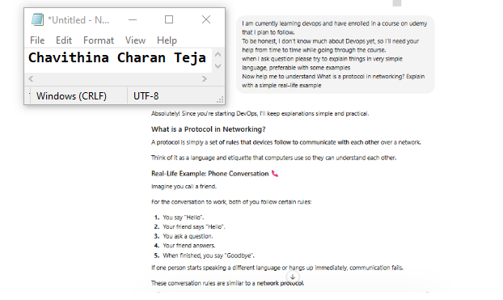
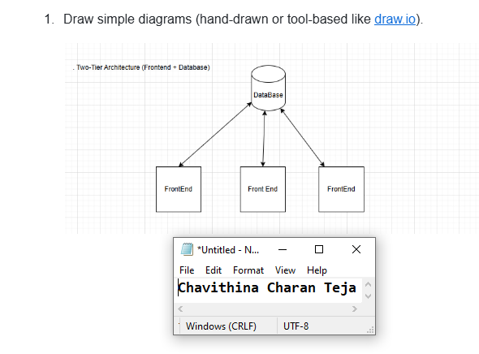
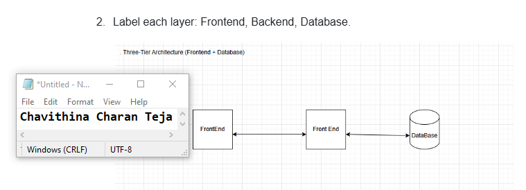
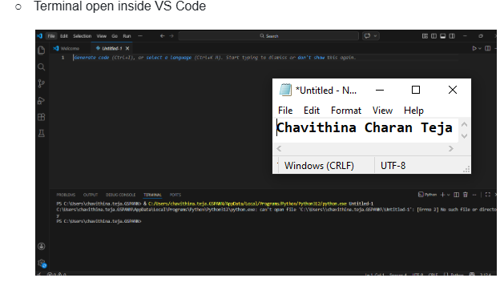
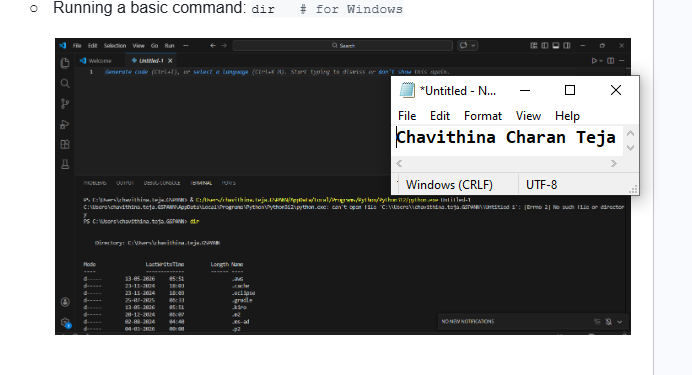

# Week 00 - Internet and Networking

Part of the DevOps Micro Internship (DMI) Cohort 3 with Agentic AI

---

# 🧑‍💻 Task 1: Using ChatGPT as Your Learning Assistant

## Scenario

You're new to DevOps and will frequently encounter technical questions. ChatGPT can be your learning companion.

## Your Task

Write a clear ChatGPT prompt to help you understand:

> "What is a protocol in networking? Explain with a simple real-life example."

Take a screenshot of your interaction showing:

* Your detailed prompt (with clear expectations)
* ChatGPT's simplified response with an example

## Screenshot

Save your screenshot in the `screenshots` folder and update the file name below.




Replace `task-1-chatgpt.png` with your actual screenshot file name.

---

## What I Learned (2–3 lines)

Protocol is a set of rules that computers follow to communicate with each other over a network.
Example: Just like two people need to speak the same language (e.g., English) to understand each other, computers use protocols like HTTP or HTTPS to exchange information correctly.


---

# 🌐 Task 2: Internet and Networking

## Scenario

Your friend is launching an online bookstore named **EpicReads**.

He asked you to explain how users globally can access his website hosted in Finland.

## Your Task

Write a short explanation (**100–150 words**) that includes:

* Packet Switching
* IP Address
* TCP/IP
* HTTP/HTTPS

💡 **Tip:** You may use ChatGPT (as demonstrated in Task 1) to refine your explanation.

## Answer

Packet Switching is a method of sending data across a network by breaking it into small packets. Each device on a network has a unique IP Address, which helps identify the sender and receiver of these packets. TCP/IP is the core set of networking protocols that ensures packets are sent, routed, and delivered correctly between devices. When you browse a website, HTTP (HyperText Transfer Protocol) is used to transfer web pages between your browser and the web server. HTTPS is the secure version of HTTP that encrypts data, protecting sensitive information such as passwords and credit card details during transmission. Together, these technologies enable reliable and secure communication over the internet.


---

# 🏗️ Task 3: Application Architecture & Stack

## Scenario

EpicReads bookstore has two application versions:

### Two-Tier Application

* Frontend
* Database

### Three-Tier Application

* Frontend
* Backend
* Database

## Your Task

* Draw simple diagrams (hand-drawn or tool-based such as draw.io)
* Label each layer clearly
* List at least two common technologies or tools used for each layer
* Submit a screenshot or photo clearly showing your own drawing

## Diagram Screenshot / Photo

Save your diagram image in the `screenshots` folder and update the file name below.




Replace `task-3-diagram.png` with your actual diagram file name.

---

## Technologies Used

### Frontend
 * HTML, CSS, JavaScript, React


### Backend


* Node.js, Java Spring Boot, Python Django

### Database

* MySQL, PostgreSQL, MongoDB, Oracle Database
---

# 🌍 Task 4: Domain Name & DNS (Basic Concepts)

## Scenario

Your friend's bookstore **EpicReads** is currently accessible through:

```text
52.172.142.222:3000
```

He purchased the domain:

```text
epicreads.com
```

## Your Task

In **50–100 words**, explain in your own words:

1. What is DNS (Domain Name System)?
2. Which DNS record type should be used to connect the domain to the given IP, and why?

## Answer


DNS (Domain Name System) is a service that translates human-friendly domain names, such as epicreads.com, into IP addresses that computers use to find websites on the internet. It works like a phonebook, allowing users to access websites using easy-to-remember names instead of numerical IP addresses. Without DNS, users would need to remember and enter IP addresses manually to visit websites. 

An A (Address) Record should be used to connect epicreads.com to the IP address 52.172.142.222. An A Record maps a domain name directly to an IPv4 address, allowing users to access the website using the domain name instead of typing the IP address. This makes the website easier to find and use. 

---

# 💻 Task 5: Visual Studio Code Setup (Hands-on)

## Your Task

Install Visual Studio Code (if not already installed).

Take a screenshot of your VS Code environment showing:

* Terminal open inside VS Code
* Running a basic command:

### Windows

```powershell
dir
```

### Linux / macOS

```bash
pwd
ls
```

* Your selected VS Code theme clearly visible

⚠️ **Important:** The screenshot must show your username or another identifiable detail to confirm it is your environment.

## Screenshot

Save your screenshot in the `screenshots` folder and update the file name below.





Replace `task-5-vscode.png` with your actual screenshot file name.

---

# 🔗 Task 6: Publish Your Assignment as a LinkedIn Post

## Objective

Publishing on LinkedIn helps you:

* Build your professional online presence
* Reinforce your learning
* Document your DevOps journey publicly

## Your Task

Summarize your answers from Tasks 1–5 into a LinkedIn post.

Clearly structure your post into the following sections:

* ChatGPT
* Internet & Networking
* App Architecture
* DNS
* VS Code Setup

Add the following credit note at the end of your post:

> **P.S. This post is part of the DevOps Micro Internship (DMI) with Agentic AI — Cohort 3 — by Pravin Mishra. My graded progress is public: https://dmi.pravinmishra.com/s/YOUR-GITHUB-USERNAME.html · Start your DevOps journey: https://dmi.pravinmishra.com/?utm_source=student&utm_medium=ps-linkedin&utm_campaign=cohort3**

---

## LinkedIn Post URL

Paste your LinkedIn post URL here:

'[https://www.linkedin.com/posts/charanteja-chavithina-7503aa25a_join-the-dmi-devops-micro-internship-share-7478878145140674560-7Jf6/?utm_source=share&utm_medium=member_desktop&rcm=ACoAAD_GNawBqypXzEm7uRwAtjIXUFi95VCH6dg]'

---

## LinkedIn Post Backup Copy

Paste the full text of your LinkedIn post here:
🚀 **Week 0 Complete – DevOps Micro Internship Cohort 3!** 🎉

Excited to share that I've successfully completed **Week 0** of my **DevOps Micro Internship – Cohort 3**.

This week focused on building a strong foundation in networking and DevOps fundamentals. My key learnings included:

✅ Understanding networking protocols with real-world examples
✅ Internet fundamentals – Packet Switching, IP Address, TCP/IP, HTTP & HTTPS
✅ Two-tier vs Three-tier application architecture
✅ DNS basics and configuring domain names using A Records
✅ Setting up Visual Studio Code and working with the integrated terminal

One of the biggest takeaways was realizing that **strong fundamentals are the backbone of every successful DevOps engineer**. Learning these concepts with practical examples made them much easier to understand and relate to real-world applications.

A big thank you to **Praveen Sir** for designing such a well-structured learning program and making complex topics easy to grasp. Also, sincere thanks to the mentors **Anjana** and **Joy** for their continuous guidance, encouragement, and support throughout the learning journey.

Looking forward to diving deeper into Linux, Shell Scripting, Cloud, CI/CD, Docker, Kubernetes, and Automation in the coming weeks.

#DevOps #LearningInPublic #ContinuousLearning #Networking #DNS #TCPIP #HTTP #CloudComputing #Linux #VSCode #DevOpsEngineer #CareerGrowth #TechLearning #MicroInternship


---

# Reflection – Week 0

### What did you find easy?
I found the networking fundamentals easy to understand, especially the concepts of protocols, DNS, IP addresses, and HTTP/HTTPS, because they were explained using simple real-life examples. I also found the comparison between two-tier and three-tier application architectures straightforward, and setting up Visual Studio Code was easy to complete by following the provided steps. Overall, the practical examples made the concepts much easier to grasp.


---

### What was difficult?

The most challenging part was understanding how all the networking concepts—Packet Switching, TCP/IP, IP addresses, HTTP/HTTPS, and DNS—work together to deliver a website over the internet. Initially, it was difficult to visualize the complete flow, but using simple examples and diagrams helped me connect the concepts. I also spent some time understanding the difference between two-tier and three-tier application architectures.

---

### What will you improve next week?
Next week, I want to improve my understanding of Linux commands and Shell scripting by practicing them daily. I also plan to spend more time on hands-on exercises so I can apply the concepts confidently instead of just learning the theory. My goal is to build a stronger foundation in DevOps and become more comfortable working in a Linux environment.


---

## 📌 About DMI & CloudAdvisory

DevOps Micro Internship (DMI) is a project-based DevOps program run by Pravin Mishra (The CloudAdvisory) focused on real-world execution, systems thinking, and career readiness.

It helps learners build strong DevOps foundations with hands-on experience.


## 📌 Resources

- 🌐 **DMI Official Website:** https://pravinmishra.com/dmi  
- 🎓 **DevOps for Beginners (Udemy):** https://www.udemy.com/course/devops-for-beginners-docker-k8s-cloud-cicd-4-projects/  
- 🎓 **Ultimate Agentic AI DevOps with Clude Code** https://www.udemy.com/course/ultimate-agentic-ai-devops-with-claude-code/?referralCode=448389767BC96284087B
- 🎓 **DevOps with Claude Code: Terraform, EKS, ArgoCD & Helm** https://www.udemy.com/course/devops-with-claude-code-terraform-eks-argocd-helm/?referralCode=1C5B734505D65A010FA3
- ▶️ **YouTube Playlist (DMI Cohort 3):** https://www.youtube.com/playlist?list=PLFeSNDtI4Cho  
- 🔗 **Pravin Mishra (LinkedIn):** https://www.linkedin.com/in/pravin-mishra-aws-trainer/  
- 🏢 **CloudAdvisory (LinkedIn):** https://www.linkedin.com/company/thecloudadvisory/

---

*This submission is part of DevOps Micro Internship (DMI) Cohort 3 — Agentic AI Track*