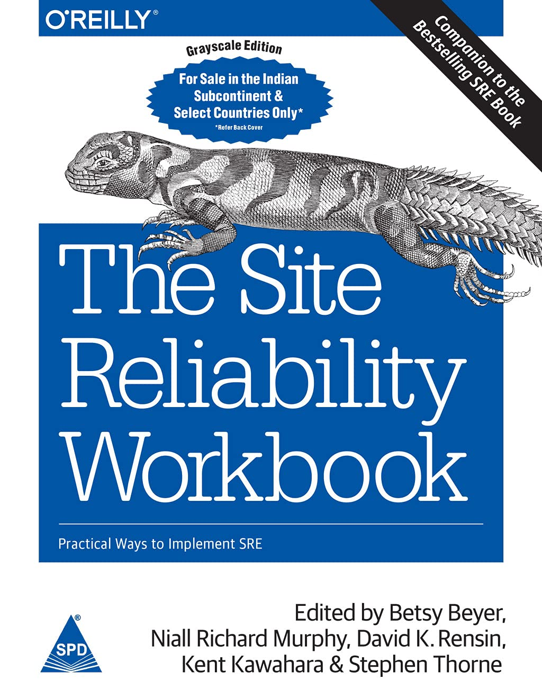
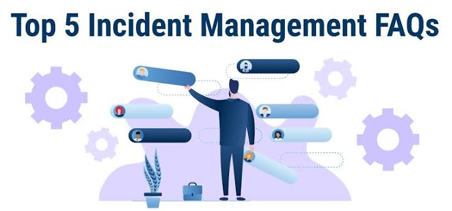
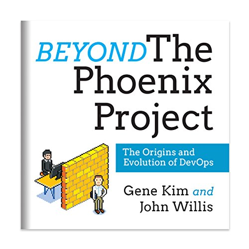
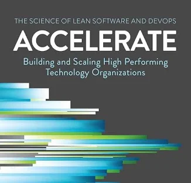
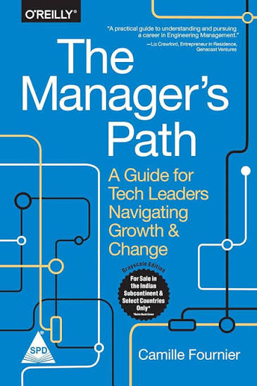

# Week 01 — Success Mindset (Mindset OS)

Part of the DevOps Micro Internship (DMI) Cohort 3 with Agentic AI

---

## Purpose (Read This First)

This week is not motivation homework.

This is you building your **Mindset OS** — the system you will use for the next 5 months (and honestly, for years).

### Expectations

* Be honest.
* Be specific.
* Be practical.
* Write like an adult professional: clear sentences, no one-liners.

You will reuse this in later weeks. So do it properly once.

---

# Assignment 1. What is something you believe to be true that most people around you would disagree with?

### Rules

I believe that taking on new challenges is one of the best ways to grow, even when others want to stay in their comfort zones. Many people around me avoid new responsibilities because they fear failure or uncertainty. However, I see challenges as chances to learn and improve. I also think that leadership is not just about giving orders; it is about supporting, motivating, and working with a team to achieve common goals. I enjoy taking initiative, managing teams, and helping others succeed. These experiences have strengthened my communication, problem-solving, and decision-making skills. They have shown me that effective leadership comes from working together and being accountable.

**Hint:** What do you believe about career, money, learning, discipline, relationships, health, success, life, tech industry, etc. that most people don't agree with?

## Answer

Career: I see a career as a journey of continuous learning and growth. I have invested in my education by completing a B.Tech in Computer Science, an M.Tech in Information Technology, and an MBA in Marketing and Human Resources. Currently, I work as a Technical Software Engineer. I aim to keep learning and adapting to new technologies throughout my career.

Money: Money is an important part of life. While it is not the only measure of happiness, having financial stability allows us to support our families, achieve our goals, and live with dignity in today's society.

Learning: I strongly believe that learning should never stop. Continuous learning improves our technical and personal skills. It keeps us relevant in a fast-changing world and helps us earn respect from our colleagues, family, and society.

Discipline: To me, discipline means commitment and consistency. It is the foundation of success, helping us stay focused, honor our responsibilities, and make the right decisions even during tough times. 

Relationships: Family, friends, and colleagues are our greatest strengths. Strong relationships provide support, encouragement, and opportunities for growth, both personally and professionally.

Health: Health is true wealth. Without good physical and mental health, it is hard to enjoy success or achieve long-term goals. Maintaining a healthy lifestyle should always be a priority. 

Success: I believe success is not just about achievements or promotions. True success is reaching our goals while finding satisfaction, continuously improving ourselves, and making a positive impact on others. 

Life: Life is a precious gift. We should make the best use of our time, pursue our dreams with dedication, help others whenever we can, and treat everyone—including family, friends, colleagues, and society—with kindness and respect. 

Technology Industry: I believe in treating my workplace with the same respect and dedication as a temple. I always strive to give my best, take ownership of my responsibilities, improve my technical skills, and contribute to building reliable, scalable, and impactful solutions for the organization.

---

# Assignment 2. What are the top 3 objective truths you discovered through experimentation and results?

### Definition

Objective truths do not depend on opinions. They hold true regardless of how people feel.

Write each truth in this format:

**Truth:** (1 sentence)

**Evidence from my life:** (2–4 lines: what you tried + what happened)

---

## Truth #1

### Truth

Since childhood, I dreamed of being an engineer. I worked hard to reach that goal, and today I am proud to say I have succeeded. This journey has shown me that with determination, ongoing learning, and persistence, long-term goals can come true.

### Evidence from my life

To become an engineer, I focused on my studies and did well academically. I earned good grades in my B.Tech and passed every semester on my first try. After finishing my degree, I moved to Hyderabad for better job opportunities and landed my first job as a Software Engineer. This journey strengthened my belief that dedication, hard work, and perseverance lead to success.

---

## Truth #2

### Truth
As a child, I set a goal for myself to buy a bike. Once I got my first job, I was able to save and manage my finances, eventually allowing me to buy my dream bike. Not only did I buy my first bike, but I also bought my first asset and gained a lot of independence. I confirmed my belief that hard work and determination will always lead to achieving a goal.

### Evidence from my life

As a child, I adored biking. I even rode my dad's bike whenever I could, and his bike made me want my own bike. After starting my career, I bought my own bike after working hard and budgeting, and I achieved my childhood dream. Since I promoted my own dream by buying my own bike, I like to think the bike bought itself.

---

## Truth #3

### Truth

Owning a car was a personal goal I had for myself. Once my children were born and had started second grade, I was able to purchase a car. This was a huge milestone for my family because we had a this major investment and an improvement in comfort, safety, and convenience as I had shown some financial stability due to my hard work over the years.

### Evidence from my life

For me, decision-making is always aimed at bringing comfort and safety to my family members. Once when I was riding a two-wheeler with my kids who were only one and three years old respectively, we had to go out into the open under heavy rains. This experience made me understand how necessary it was for me to have another safer mode of transport for my family members.

Ever since then, I have always been determined to take my family members wherever we need to go in either our own car or in a cab. With my successful career progression and the second grade of my kids, I have managed to achieve this aim through buying my own car.

---

# Assignment 3. What does your 2.0 version look like?

### Instructions

Write as if a journalist is writing about you **3 to 7 years from now** (not 20 years).

**Minimum 300 words.**

### Rules

* Write in past tense, like it already happened.
* Don't use "likes to / wants to / hopes to."
* Use specifics:

  * built
  * shipped
  * led
  * published
  * earned
  * relocated
  * contributed
* Include skills proof:

  * projects
  * portfolios
  * GitHub
  * blogs
  * certifications
  * job role
  * leadership
  * community contribution
* Add 1–3 images if you can (optional but powerful).

### Publish It Publicly On Any ONE

* LinkedIn
* Medium
* WordPress
* Blogspot
* Personal blog
* Portfolio page

Include this line:

> **P.S. This post is part of the DevOps Micro Internship (DMI) with Agentic AI — Cohort 3 — by [Pravin Mishra](https://www.linkedin.com/in/pravin-mishra-aws-trainer/). My graded progress is public: https://dmi.pravinmishra.com/s/YOUR-GITHUB-USERNAME.html · Start your DevOps journey: https://dmi.pravinmishra.com/?utm_source=student&utm_medium=ps-blog&utm_campaign=cohort3**

## Your Article

This is Charan here, I am currently working as an Technical manager and have experience in java microservices and production support. As a manager my focus is to enhance three pillars;system reliability operation excellence and team enablement. 
I led large technical teams and partnered with the global business stakeholders for delivery of stable, secured, and cost-efficient platforms. 

I manage cross-functional teams of around 40 members I ensure with owner ship models, encourage incident management & ICA culture. I promote proactive communication with our stakeholders, and establish/create a strong release management and deployment governance model, involved in monitoring key metrics, KPIs, first contact resolution. And regularly engage with client stakeholders, conduct status review meetings, and present reliability metrics. 

Right now, at this stage of my career, my focus has not just been on technical execution, but also on building high performing teams, maturing our engineering processes and aligning technology to the business outcome. 

My Continuous Learning Journey: Certifications That Shaped My Career in Site Reliability Engineering

In the rapidly evolving technology industry, learning never stops. Over the years, I have realized that technical expertise alone is not enough. To build reliable, scalable, and resilient systems, professionals must continuously upgrade their skills, embrace new technologies, and develop leadership capabilities.

As a Site Reliability Engineering (SRE) Manager with over 14 years of experience in Production Operations, Cloud Infrastructure, Observability, Incident Management, Automation, and DevOps, I strongly believe that continuous learning is the key to long-term success.

This belief has motivated me to pursue several professional certifications and specialized training programs that have enhanced both my technical and management skills.

Google Cloud Certified – Site Reliability Engineering & Cloud Monitoring (Coursera)

This certification strengthened my understanding of Google's Site Reliability Engineering principles and modern cloud operations. It covered topics such as:

SRE principles and practices
Service Level Indicators (SLIs)
Service Level Objectives (SLOs)
Service Level Agreements (SLAs)
Error budgets
Incident management
Cloud monitoring and observability
Reliability engineering best practices

These concepts have helped me improve production stability, reduce operational risks, and build more reliable services.

Certified Scrum Master (Coursera)

Modern engineering teams thrive on collaboration and agility. This certification provided me with practical knowledge of Agile methodologies, including:

 Scrum framework
 Sprint planning
 Daily stand-ups
 Sprint reviews
 Retrospectives
 Team collaboration
 Continuous improvement

It has enabled me to lead engineering teams more effectively and foster a culture of transparency, accountability, and continuous delivery.

Google Project Management Certification (Coursera)

Technical leadership also requires strong project management skills. Through this certification, I learned:

 Project planning
 Risk management
 Stakeholder communication
 Resource planning
 Schedule management
 Change management
 Agile project execution

These skills have helped me successfully deliver production initiatives while balancing business priorities and technical objectives.

 AWS + DevOps Training (Coursera)

Cloud-native applications demand automation, scalability, and operational excellence. This training enhanced my knowledge of:

 AWS services
 Infrastructure as Code
 CI/CD pipelines
 DevOps culture
 Cloud security
 Monitoring
 Deployment automation
 High availability

It reinforced the importance of automation in reducing manual effort and improving deployment reliability.
These skills have enabled me to make faster, data-driven decisions during critical production incidents.
Red Hat OpenShift Administration II (DO280) – Prodevans Professional

As organizations increasingly adopt containerized platforms, Kubernetes and OpenShift have become essential technologies.

This advanced training covered:

 OpenShift administration
 Kubernetes workloads
 Container orchestration
 Application deployment
 Networking
 Storage management
 Security
 Cluster operations

The knowledge gained has strengthened my ability to manage cloud-native environments and support highly available enterprise applications.

 My Biggest Takeaway

Each certification taught me something valuable, but the greatest lesson has been that learning is a continuous journey. Certifications are not just credentials—they are opportunities to broaden knowledge, solve real-world challenges, and become a better engineer and leader.

Technology continues to evolve, and so should we. By investing in continuous learning, we remain adaptable, innovative, and prepared for future challenges.

 Looking Ahead

I will continue expanding my expertise in:

 Artificial Intelligence for IT Operations (AIOps)
 Cloud-native technologies
 Platform Engineering
 Kubernetes and OpenShift
 Automation
 Observability
 Site Reliability Engineering
 Leadership and Engineering Management

My goal is to build reliable systems, empower engineering teams, and contribute to creating resilient and scalable technology solutions that deliver exceptional customer experiences.

 Published author of the White paper “An Introduction to Artificial Intelligence 
for IT Organizations,” focused on AIOps, AI-driven monitoring, and modern 
observability   practices.

Engineering Your Future: My Education in Technology and Business Leadership
Education has always been my north star in the ever-evolving universe of technology and leadership. I’ve long held the belief that to innovate, to conquer complex challenges, and to grow as a professional, a solid understanding of both technology and business is paramount. It’s this conviction that has guided my academic pursuits, leading me down paths in engineering, information technology, and ultimately, business management.

Master of Technology (M. Tech) in Information Technology
My formal foray into advanced information technology came through my Master of Technology (M. Tech) in Information Technology from the esteemed Jawaharlal Nehru Technological University, Kakinada (JNTUK), where I achieved a commendable 74%. This program was a crucible that honed my skills in:
   Advanced Software Engineering methodologies
   Robust Database Management Systems
   Complex Computer Networks
   Distributed Computing principles
   The intricacies of Information Security
   Rigorous Research Methodologies
   Cutting-edge Emerging Technologies
The M. Tech not only sharpened my analytical acuity and technical depth but also equipped me to tackle the most formidable challenges within enterprise technology landscapes.

Bachelor of Technology (B. Tech) in Computer Science and Engineering
My foundational education was a Bachelor of Technology (B. Tech) in Computer Science and Engineering from Jawaharlal Nehru Technological University, Hyderabad (JNTUH), where I graduated with 68.87%. This rigorous degree was my initial dive into the heart of computing and covered:
   Core Programming concepts
   Efficient Data Structures and Algorithms
   Operating System fundamentals
   The interconnectedness of Computer Networks
   The architecture of Software Engineering
   Database Management Systems intricacies
    The hardware of Computer Architecture
It was within the dynamic environment of the B. Tech that the sparks of my passion for crafting innovative software solutions were truly ignited.

Master of Business Administration (MBA) with Specializations in Marketing and Human Resources
Recognizing that technology alone does not drive business success, I further invested in my business acumen by pursuing a Master of Business Administration (MBA), with specific concentrations in Marketing and Human Resources. The MBA proved to be a powerful amplifier to my technical foundation, broadening my strategic vision and equipping me with vital skills in:
   Strategic Management paradigms
   Customer-centric Marketing strategies
   Effective Human Resource Management practices
   The nuances of Organizational Behavior
   Strong Leadership and Team Management techniques
   Clear and impactful Business Communication
   Efficient Project and Operations Management
   Decisive Problem-Solving and critical Decision-Making
This powerful fusion of engineering expertise and business acumen is, I believe, the key to bridging the chasm between technical teams and business objectives, fostering high-performance teams, and orchestrating technological initiatives to meet and exceed organizational goals.

Lifelong Learning: A Continuous Pursuit of Excellence
While my formal education has provided a robust bedrock, I firmly believe that true mastery is an ongoing journey. Beyond my academic achievements, I am perpetually committed to expanding my knowledge through professional certifications and hands-on experience in areas such as:
   Site Reliability Engineering (SRE)
   Cloud Computing technologies
   DevOps principles and practices
   Observability tools and strategies
   Incident Management frameworks
   Automation techniques
   Artificial Intelligence for IT Operations (AIOps)
   Engineering Leadership best practices
The synergistic combination of my engineering knowledge, business insight, and unwavering dedication to lifelong learning has been absolutely pivotal in forging my career as a technology leader. It empowers me to drive innovation, build resilient and scalable systems, inspire and lead diverse teams, and ultimately, deliver tangible and meaningful business outcomes.

 This post is a part of DevOps Micro Internship with Agentic AI Cohort-3 by [Pravin Mishra](https://www.linkedin.com/in/pravin-mishra-aws-trainer/). You can start your DevOps journey by joining this [Discord community](https://discord.pravinmishra.com/) ( https://discord.pravinmishra.com/ ).**

### Public Link

Paste your link here:

<<<<<<< HEAD
`https://dev.to/charanteja_chavithina_b67/about-my-self-20ki`
=======
`Add your URL here`
>>>>>>> upstream/main

---
# Assignment 4. Have you ever cut corners (unethical / dishonest / shortcut behavior — not necessarily illegal)? If yes, how did it make you feel?

### Important

You don't need to write the full story.

Focus on the feeling:

* guilt
* fear
* shame
* stress
* regret
* numbness
* etc.

This is about self-awareness, not judgment.

There have been instances where I've taken shortcuts due to tight deadlines early on in my career. For instance, sometimes I prioritized getting a certain change out as fast as possible without ensuring all necessary documentation was complete or doing a full review of what needed to happen.

This resulted in some confusion during production support and knowledge transfer down the line, which led me to recognize how important it is to follow established engineering processes going forward. Since then, I've developed even better discipline around making sure things are documented properly, tested adequately, etc., before deploying anything.

If I'm managing teams now, I would definitely advocate for transparency over taking shortcuts because they tend to create longer term problems than short term gains - especially if those shortcuts compromise quality or reliability. As managers, being able to set clear expectations while still maintaining integrity helps build trust with our people & businesses alike.

That's great! It shows all of these qualities you mentioned - accountability, continuous learning, engineering discipline, leadership, commitment to production reliability.

As an SRE/Technical Manager I would also note this shows he learned from his mistake (and didn't do anything unethical).

**Yes / No**

If Yes:

Alot of emotions in daily from childhood onwards going to school, college and office

## Answer

Yes.

---

# Assignment 5. What are 10 non-fiction books you plan to read in the next 1 year?

### Rules

* Mention **Title + Author**
* Any language allowed
* No fiction novels

### Tip

Choose books that improve:

* mindset
* communication
* productivity
* health
* money
* career
* leadership

## Book List

The Site Reliability Workbook – Betsy Beyer, Niall Richard Murphy, David Rensin, Kent Kawahara & Stephen Thorne
 To gain practical strategies for improving reliability, incident management, and operational excellence.
The Phoenix Project – Gene Kim, Kevin Behr & George Spafford
To deepen my understanding of DevOps culture, collaboration, and IT transformation.
 Accelerate – Nicole Forsgren, Jez Humble & Gene Kim
To learn how high-performing engineering teams achieve faster delivery while maintaining reliability.
 The Manager's Path – Camille Fournier
To strengthen my engineering management and leadership skills.
Thinking, Fast and Slow – Daniel Kahneman
To improve decision-making, problem-solving, and critical thinking.
Atomic Habits – James Clear
To build better personal and professional habits through small, consistent improvements.
The Lean Startup – Eric Ries
To understand innovation, experimentation, and continuous improvement.
Measure What Matters – John Doerr
To learn how effective goal setting and OKRs drive organizational success.
AI Engineering – Chip Huyen
To expand my knowledge of AI systems and their practical application in modern engineering organizations.
The Five Dysfunctions of a Team – Patrick Lencioni
To become a more effective leader by building trust, collaboration, and high-performing teams.
---

# Assignment 6. What are the things you will measure regularly in your life and career?

### Rules

List topics only. No need to share numbers.

### Must Include

* Learning / skill
* Output / proof
* Health / energy
* Time / focus
* Money / finance (personal or business)

### Example

* Learning hours per week
* Deep work sessions per week
* Projects shipped / documented
* Steps / workouts
* Sleep hours
* Spending tracker

## My Metrics

Learning hours per week
Professional certifications completed
New technologies and tools learned
Technical books and articles read
Hands-on labs and practice sessions
Blogs, white papers, or knowledge-sharing sessions published
Projects successfully delivered
Production incidents resolved
System reliability (SLA/SLO/SLI) improvements
Automation initiatives completed
Team mentoring and coaching sessions
Team skill development and training progress
Stakeholder feedback
Customer satisfaction
Deep work sessions
Daily focus time
Time spent on strategic planning
Work-life balance
Physical exercise and workouts
Daily walking or step count
Sleep quality and duration
Energy and stress levels
Annual health checkups
Personal savings and investments
Monthly expense tracking
Emergency fund progress
Family quality time
Personal goal completion
Community contributions and helping others
Gratitude and self-reflection

---

# Assignment 7. Brain Dump + 5-Month System Plan

## Step 1: Brain Dump (Private)

Do a brain dump of everything in your mind into a notebook.

Examples:

* Bills
* Tasks
* Worries
* Goals
* Pending messages
* Ideas
* Responsibilities

### Did You Do It?

**Yes / No**

Answer:

Yes, I completed a brain dump by writing down everything that was on my mind, including my personal and professional goals, pending tasks, responsibilities, interview preparation, career plans, learning objectives, financial goals, family commitments, health priorities, certifications, blog writing ideas, and other important reminders. This exercise helped me organize my thoughts, reduce mental clutter, and prioritize what needs my attention over the coming months.

---

## Step 2: Your 5-Month Routine + Focus Blocks

Create a simple plan you can realistically follow for the next 5 months.

### Weekly Routine

Example:

* Mon–Thu: 60 min deep work
* Sat: DMI session
* Sun: Weekly review

#### My Weekly Routine

Based on your goals of becoming a stronger SRE Manager, preparing for leadership opportunities, continuous learning, and maintaining work-life balance, here's a realistic 5-month weekly routine.

My Weekly Routine

Monday – Thursday

1 hour of deep technical learning (SRE, Cloud, Kubernetes, AI, DevOps)
30 minutes of interview preparation and communication practice
30 minutes of physical exercise or walking
Review daily priorities and complete high-impact work tasks

Friday

Review weekly achievements and pending tasks
Update technical notes, blogs, or documentation
Plan goals for the following week

Saturday

Complete online certification courses or hands-on labs
Work on personal projects, automation, or blog writing
Spend quality time with family

Sunday

Weekly review of personal, financial, and career goals
Read a technical or leadership book
Plan the upcoming week's schedule
Rest, recharge, and spend time with family
My Focus Areas for the Next 5 Months
Strengthen Site Reliability Engineering and Cloud expertise
Improve Engineering Management and Leadership skills
Complete professional certifications
Publish technical blogs and knowledge-sharing articles
Enhance communication and public speaking skills
Prepare for senior leadership interviews
Improve physical fitness and maintain a healthy lifestyle
Track personal finances and investments
Spend quality time with family and maintain work-life balance
Practice continuous learning and self-improvement

This plan is practical, sustainable, and aligned with both your professional growth and personal well-being.

---

### Focus Blocks

#### When Will You Do DMI Work? (Days + Time)

Monday to Thursday: 8:00 PM – 9:00 PM
Saturday: 10:00 AM – 12:00 PM
Sunday: 9:00 AM – 10:00 AM (Weekly review and planning)

This schedule allows me to consistently focus on DMI assignments, technical learning, interview preparation, and personal development while balancing my professional responsibilities and family time.

#### How Many Sessions Per Week?

7 sessions per week

Monday–Thursday: 4 sessions (1 hour each)
Saturday: 2 sessions (2-hour learning block)
Sunday: 1 session (weekly review and planning)

---

### Distraction Rules

Examples:

* Phone rules
* Social media rules
* Environment setup

#### My Distraction Rules

My Distraction Rules
Keep my phone on Do Not Disturb (DND) during deep work and DMI sessions.
Avoid using social media (YouTube, Instagram, Facebook, etc.) during study hours unless it is for learning.
Keep my workspace clean, organized, and free from unnecessary distractions.
Close unrelated browser tabs and applications while working or studying.
Turn off unnecessary email and messaging notifications.
Follow a fixed schedule for learning, work, and family time.
Complete the most important task before checking messages or social media.
Take a 5–10 minute break after every 60–90 minutes of focused work.
Inform my family about my study time to minimize interruptions.
Review my daily progress at the end of each day and prepare a plan for the next day.

These rules will help me stay focused, improve productivity, and consistently achieve my personal and professional goals.

---

# Reflection – Week 1

### Biggest insight I got about myself this week

his week, I realized that I perform best when I have a clear plan and follow a consistent routine. I also recognized that continuous learning is one of my greatest strengths and that I enjoy improving both my technical and leadership skills. Organizing my goals, reducing distractions, and focusing on one task at a time helps me stay productive. Most importantly, I learned that small, consistent efforts every day are more effective than waiting for the perfect time to achieve my long-term career and personal goals.

### My biggest weakness/loop I noticed

I noticed that I sometimes spend too much time trying to make things perfect before considering them complete. I also tend to take on multiple responsibilities at the same time, which can reduce my focus on the highest-priority task. Occasionally, I postpone my personal learning and career development because of work commitments. Going forward, I want to improve by prioritizing important tasks, avoiding perfectionism where it isn't necessary, and consistently dedicating time to my learning and personal growth.

### One system I will implement from this week (exact habit + time)

One System I Will Implement From This Week (Exact Habit + Time)

Habit: Every weekday, I will dedicate 1 hour to focused learning and career development without any distractions. During this time, I will work on DMI assignments, technical learning (SRE, Cloud, DevOps, AI), interview preparation, or blog writing.

Time: Monday to Thursday, 8:00 PM – 9:00 PM

After each session, I will spend 10 minutes (9:00 PM – 9:10 PM) reviewing what I learned and planning the next day's most important task. This routine will help me build consistency, improve my skills, and make steady progress toward my long-term career goals.

### LinkedIn Post

Paste your LinkedIn post link here:

<<<<<<< HEAD
`https://www.linkedin.com/posts/charanteja-chavithina-7503aa25a_join-the-dmi-devops-micro-internship-share-7478878145140674560-7Jf6/?utm_source=share&utm_medium=member_desktop&rcm=ACoAAD_GNawBqypXzEm7uRwAtjIXUFi95VCH6dg__________________________`
=======
`Add your URL here`
>>>>>>> upstream/main

---

## 10. Proof of Work

- LinkedIn Post URL: **[ADD LINK HERE](https://www.linkedin.com/posts/charanteja-chavithina-7503aa25a_join-the-dmi-devops-micro-internship-share-7478878145140674560-7Jf6/?utm_source=share&utm_medium=member_desktop&rcm=ACoAAD_GNawBqypXzEm7uRwAtjIXUFi95VCH6dg)**  
- Blog / Medium : **[ADD LINK HERE](https://dev.to/charanteja_chavithina_b67/about-my-self-20ki)**  

---

## 📌 About DMI & CloudAdvisory

DevOps Micro Internship (DMI) is a project-based DevOps program run by Pravin Mishra (The CloudAdvisory) focused on real-world execution, systems thinking, and career readiness.

It helps learners build strong DevOps foundations with hands-on experience.

## 📌 Resources

- 🌐 **DMI Official Website:** https://pravinmishra.com/dmi  
- 🎓 **DevOps for Beginners (Udemy):** https://www.udemy.com/course/devops-for-beginners-docker-k8s-cloud-cicd-4-projects/  
- 🎓 **Ultimate Agentic AI DevOps with Clude Code** https://www.udemy.com/course/ultimate-agentic-ai-devops-with-claude-code/?referralCode=448389767BC96284087B
- 🎓 **DevOps with Claude Code: Terraform, EKS, ArgoCD & Helm** https://www.udemy.com/course/devops-with-claude-code-terraform-eks-argocd-helm/?referralCode=1C5B734505D65A010FA3
- ▶️ **YouTube Playlist (DMI Cohort 3):** https://www.youtube.com/playlist?list=PLFeSNDtI4Cho  
- 🔗 **Pravin Mishra (LinkedIn):** https://www.linkedin.com/in/pravin-mishra-aws-trainer/  
- 🏢 **CloudAdvisory (LinkedIn):** https://www.linkedin.com/company/thecloudadvisory/

---

*This submission is part of DevOps Micro Internship (DMI) Cohort 3 — Agentic AI Track*