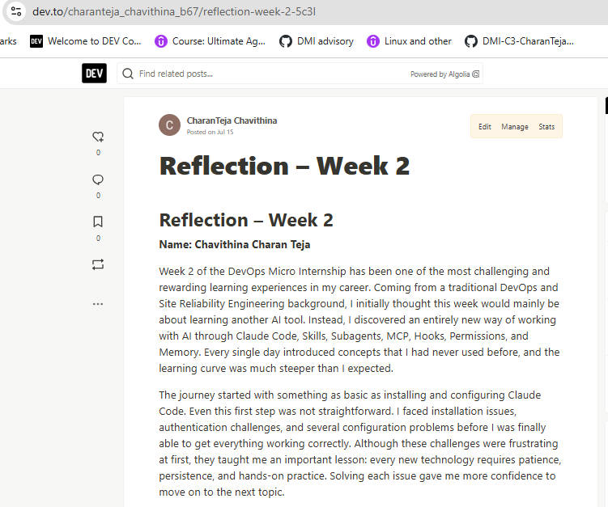
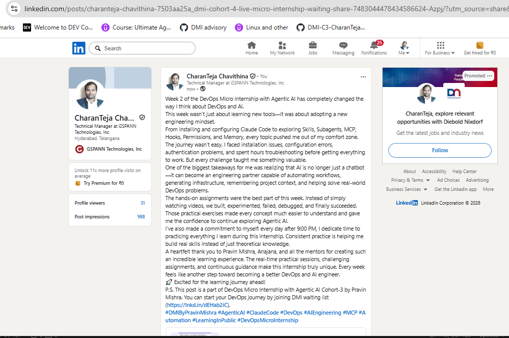

# Assignment 8 — Week 2 Reflection Blog

Part of the DevOps Micro Internship (DMI) Cohort 3 with Agentic AI

---

# Purpose

In this assignment, you will reflect on your Week 2 learning journey and write a short blog capturing your experience working with Agentic AI tools such as Claude Code, Skills, Subagents, MCP, Hooks, Permissions, and Memory.

You will also publish a LinkedIn post summarizing your learning and share both links for evaluation.

---

# Task 1 — Write Your Reflection Blog

## Goal

Write a reflection blog covering your Week 2 learning experience.

### Blog Requirements

Your blog must include:

* Title: **Reflection – Week 2**
* Minimum 300 words
* At least 2–3 topics from Week 2 (Claude Code, Skills, Subagents, MCP, Hooks, Permissions, Memory)
* Honest personal reflection (learning, challenges, mindset)
* One habit/system you plan to implement
* Your full name clearly visible

### Allowed Platforms

You can publish your blog on:

* Hashnode
* Medium
* Dev.to
* LinkedIn Article
* GitHub Markdown file
* Substack

---

### Evidence

#### Screenshot 1 — Blog published and visible


---

### Submission Field

Blog Link:

[`https://dev.to/charanteja_chavithina_b67/reflection-week-2-5c3l`]

---

# Task 2 — Create LinkedIn Post

## Goal

Share your Week 2 learning publicly on LinkedIn.

---

### LinkedIn Post Requirements

Your post must include:

* One screenshot from any Week 2 assignment
* Short reflection (what you learned or built)
* Required P.S. line exactly as given below

---

### Required P.S. Line (Must Include Exactly)

> **P.S. This post is part of the DevOps Micro Internship (DMI) with Agentic AI — Cohort 3 — by [Pravin Mishra](https://www.linkedin.com/in/pravin-mishra-aws-trainer/). My graded progress is public: https://dmi.pravinmishra.com/s/YOUR-GITHUB-USERNAME.html · Start your DevOps journey: https://dmi.pravinmishra.com/?utm_source=student&utm_medium=ps-linkedin&utm_campaign=cohort3**

---

### Suggested Hashtags

#DMIByPravinMishra #AgenticAI #ClaudeCode #DevOps #LearningInPublic

---

### Evidence

#### Screenshot 2 — LinkedIn post published

 

---

### Submission Field

LinkedIn Post Content (copy-paste here):

```
Week 2 of the DevOps Micro Internship with Agentic AI has completely changed the way I think about DevOps and AI.
This week wasn't just about learning new tools—it was about adopting a new engineering mindset.
From installing and configuring Claude Code to exploring Skills, Subagents, MCP, Hooks, Permissions, and Memory, every topic pushed me out of my comfort zone. The journey wasn't easy. I faced installation issues, configuration errors, authentication problems, and spent hours troubleshooting before getting everything to work. But every challenge taught me something valuable.
One of the biggest takeaways for me was realizing that AI is no longer just a chatbot—it can become an engineering partner capable of automating workflows, generating infrastructure, remembering project context, and helping solve real-world DevOps problems.
The hands-on assignments were the best part of this week. Instead of simply watching videos, we built, experimented, failed, debugged, and finally succeeded. Those practical exercises made every concept much easier to understand and gave me the confidence to continue exploring Agentic AI.
I've also made a commitment to myself: every day after 9:00 PM, I dedicate time to practicing everything I learn during this internship. Consistent practice is helping me build real skills instead of just theoretical knowledge.
A heartfelt thank you to Pravin Mishra, Anajana, and all the mentors for creating such an incredible learning experience. The real-time practical sessions, challenging assignments, and continuous guidance make this internship truly unique. Every week feels like another step toward becoming a better DevOps and AI engineer.
🚀 Excited for the learning journey ahead!
P.S. This post is a part of DevOps Micro Internship with Agentic AI Cohort-3 by Pravin Mishra. You can start your DevOps journey by joining DMI waiting list (https://lnkd.in/dEHab2iC).
#DMIByPravinMishra #AgenticAI #ClaudeCode #DevOps #AIEngineering #MCP #Automation #LearningInPublic #DevOpsMicroInternship
```

---

### LinkedIn Post Link:

[`https://www.linkedin.com/posts/charanteja-chavithina-7503aa25a_dmi-cohort-4-live-micro-internship-waiting-share-7483044478434586624-Azpj/?utm_source=share&utm_medium=member_desktop&rcm=ACoAAD_GNawBqypXzEm7uRwAtjIXUFi95VCH6dg`]

---

# Submission Instructions

* Blog must be publicly accessible
* LinkedIn post must be visible (public or unlisted where applicable)
* All required fields must be filled
* Screenshot proofs must be added to GitHub repository
* Do not include sensitive information in blog or post

---

# Completion Checklist

* [X] Blog written with required structure
* [X] Blog includes at least 2–3 Week 2 topics
* [X] Blog is publicly accessible
* [X] LinkedIn post created
* [X] Required P.S. line included
* [X] LinkedIn post content copied in submission field
* [X] Blog link added
* [X] LinkedIn post link added
* [X] Screenshots added to GitHub repo

---

# About DMI & CloudAdvisory

DevOps Micro Internship (DMI) is a project-based DevOps program run by Pravin Mishra (The CloudAdvisory), focused on real-world execution, systems thinking, and agentic AI workflows.

It helps learners build strong DevOps foundations through hands-on experience.

---

# Resources

* 🌐 DMI Official Website: [https://pravinmishra.com/dmi](https://pravinmishra.com/dmi)
* 🎓 DevOps for Beginners (Udemy): [https://www.udemy.com/course/devops-for-beginners-docker-k8s-cloud-cicd-4-projects/](https://www.udemy.com/course/devops-for-beginners-docker-k8s-cloud-cicd-4-projects/)
* 🎓 Agentic AI DevOps with Claude Code: [https://www.udemy.com/course/ultimate-agentic-ai-devops-with-claude-code/](https://www.udemy.com/course/ultimate-agentic-ai-devops-with-claude-code/)
* 🎓 DevOps with Claude Code: Terraform, EKS, ArgoCD & Helm: [https://www.udemy.com/course/devops-with-claude-code-terraform-eks-argocd-helm/](https://www.udemy.com/course/devops-with-claude-code-terraform-eks-argocd-helm/)
* ▶️ YouTube Playlist: [https://www.youtube.com/playlist?list=PLFeSNDtI4Cho](https://www.youtube.com/playlist?list=PLFeSNDtI4Cho)
* 🔗 Pravin Mishra (LinkedIn): [https://www.linkedin.com/in/pravin-mishra-aws-trainer/](https://www.linkedin.com/in/pravin-mishra-aws-trainer/)
* 🏢 CloudAdvisory (LinkedIn): [https://www.linkedin.com/company/thecloudadvisory/](https://www.linkedin.com/company/thecloudadvisory/)
