# Assignment 3 — Production Maintenance Drill (OPS Checklist)

Part of the DevOps Micro Internship (DMI) Cohort 3 with Agentic AI

---

## Purpose

In this assignment, you will treat your already deployed React application (on Ubuntu VM with Nginx) as a live production system. You will perform structured operational checks covering network validation, service health, log analysis, resource monitoring, configuration verification, and incident simulation with recovery — mirroring real on-call DevOps responsibilities.

---

# Task 1 — Server Access & Networking Validation

## Goal

Verify that the deployed React application is reachable from the browser and confirm basic network connectivity of the Ubuntu VM.

### Evidence

#### Screenshot 1 — Browser showing the React app with your Full Name visible on the UI

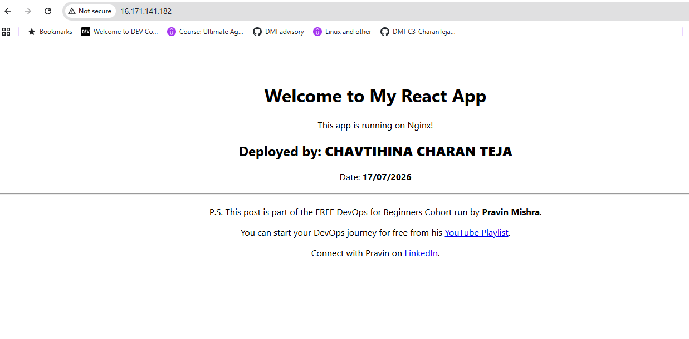

---

#### Screenshot 2 — Output of `ip a`

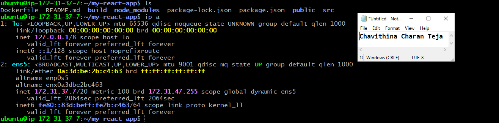

---

#### Screenshot 3 — Output of `sudo ss -tulpen`

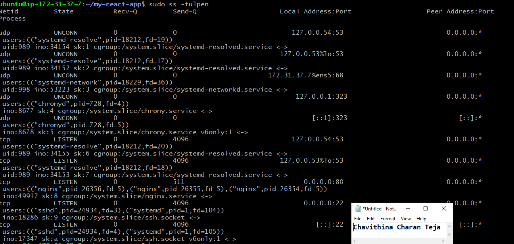

---

#### Screenshot 4 — Output of `sudo ufw status`

---

### Notes

Answer the following in your own words:

**1. What proves Nginx is listening on 0.0.0.0:80?**

In the sudo ss -tulpen output, the entry tcp LISTEN 0.0.0.0:80 ... nginx confirms that Nginx is actively listening on port 80. The address 0.0.0.0 indicates that Nginx is bound to all available network interfaces, rather than only localhost (127.0.0.1). This allows the web server to accept incoming HTTP connections from any IP address, including external clients over the internet (provided the firewall and security group rules permit it). The presence of the nginx process in the output confirms that Nginx, and not another application, is the service currently listening on port 80.

---

**2. What proves SSH is active on port 22?**

The sudo ss -tulpen output also shows the entry tcp LISTEN 0.0.0.0:22 ... sshd, confirming that the SSH daemon (sshd) is actively listening on port 22 on all network interfaces. The address 0.0.0.0 means the SSH service accepts connections from any available network interface, enabling remote users to securely access the server via SSH (provided firewall and security group rules allow access). The sshd process name confirms that the SSH service is the application listening on port 22.

---

**3. Did you find any unexpected open ports? Explain briefly.**

No unexpected ports were found in the sudo ss -tulpen output. In addition to Nginx listening on port 80 and SSH (sshd) on port 22, the only other listening services were chronyd (used for time synchronization) and systemd-resolved (used for DNS resolution). Both services were bound only to loopback addresses such as 127.0.0.1, 127.0.0.53, and 127.0.0.54, meaning they are accessible only from the local machine and cannot be reached from external networks. This confirms that only the two intended services—the Nginx web server and the SSH service—are exposed to external clients.

---

# Task 2 — Service Health & Systemd Validation (Nginx)

## Goal

Verify that Nginx is properly installed, running, enabled at boot, and safely configured.

### Evidence

#### Screenshot 1 — Output of `systemctl status nginx --no-pager`

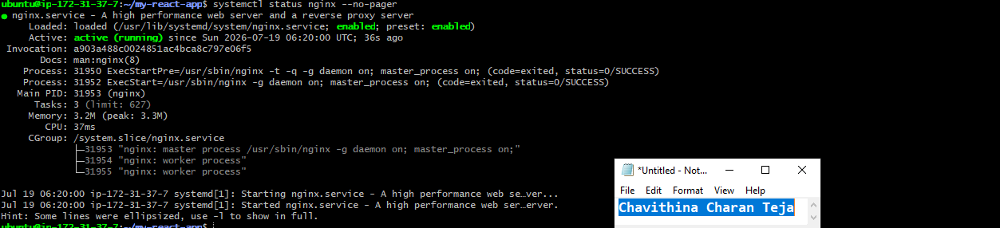

---

#### Screenshot 2 — Output of `sudo nginx -t`

---

#### Screenshot 3 — Output of `sudo ss -lptn '( sport = :80 )'`

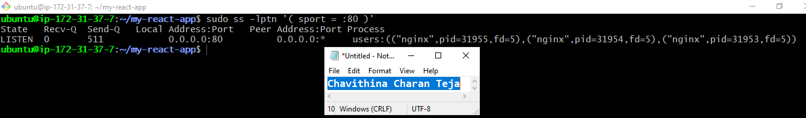

---

### Notes

Answer the following in your own words:

**1. What happens if Nginx fails to restart in production?**

If Nginx fails to restart, the website becomes unavailable because Nginx is the only service listening on port 80 and handling incoming HTTP requests. As a result, users attempting to access the website would encounter a connection refused error or a timeout, since no process would be accepting connections on that port. This is particularly critical during deployments or configuration changes, as a failed restart can cause unexpected downtime. Without an automatic recovery mechanism, manual intervention is required to identify the cause of the failure, correct the issue, and restart the Nginx service to restore website availability.

---

**2. What's your basic rollback plan?**

Before making any configuration changes, always run sudo nginx -t to validate the Nginx configuration syntax. This helps identify syntax errors or invalid directives before attempting a restart, preventing unnecessary downtime. If a restart fails, the first step is to check the service status using systemctl status nginx --no-pager and review the recent logs with sudo journalctl -u nginx --no-pager -n 50 to identify the exact cause of the failure.

If the issue is caused by an incorrect configuration change, revert the configuration file to the last known working version, preferably from a backup or version control system. After restoring the configuration, run sudo nginx -t again to verify the syntax, then restart the service using sudo systemctl restart nginx. Maintaining a backup of the working configuration before making changes is a best practice, as it enables a quick rollback and minimizes downtime without requiring extensive troubleshooting during an outage.

---

# Task 3 — Logs & Request Trace

## Goal

Verify real traffic flow and analyze logs to understand system behavior and errors.

### Evidence

#### Screenshot 1 — Output of `sudo tail -n 30 /var/log/nginx/access.log`

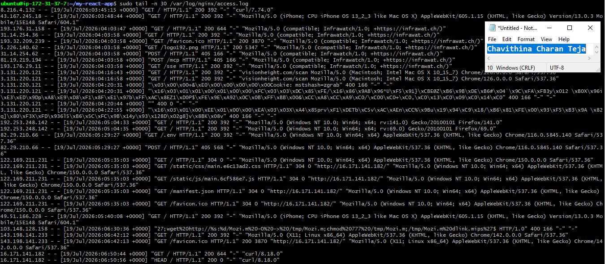

---

#### Screenshot 2 — Output of `sudo tail -n 30 /var/log/nginx/error.log`

---

#### Screenshot 3 — Output of `sudo journalctl -u nginx --no-pager -n 50`

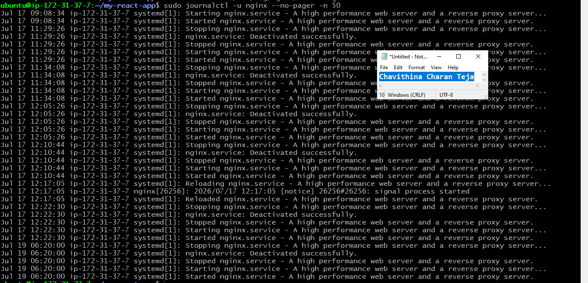

---

### Notes

Answer the following in your own words:

**1. Were there any errors in the logs?**

- If yes, mention 1–2 example error lines from the logs and explain what each one means in simple terms.
- If no, explain what it means if the error log is empty or shows no recent errors during your check.

No output was returned, indicating that the Nginx error log is currently empty or contains no recent entries. This is a positive sign, as it suggests that Nginx has not encountered any internal errors, configuration issues, or request-processing failures during its recent operation.

---

**2. If there were no errors, what does that indicate about the system?**

However, an empty error log does not guarantee that the server is permanently error-free. It simply means that no errors have been recorded within the current logging period. As the server continues to handle traffic, the error log should be monitored regularly to identify and address any new issues promptly, helping maintain the reliability and stability of the web service.

---

**3. Based on the access logs, were your curl requests visible in the log entries? What does that prove about traffic flow?**

We used this command to verify that Nginx is correctly recording incoming HTTP requests in the access log. Access logs are essential for monitoring legitimate user activity, troubleshooting application issues, analyzing traffic patterns, and identifying suspicious or malicious requests targeting the server.

The log shows a combination of normal user traffic and automated scanning activity. Legitimate visitors successfully accessed the homepage (/) and downloaded static assets such as the CSS stylesheet, JavaScript bundle, manifest.json, and favicon.ico, confirming that the React application was served correctly. Your own test request is also recorded in the log:

16,171,141,182, ... "GET / HTTP/1.1" 200 ... "curl/8.18.0"

This confirms that the curl request successfully reached the server and was properly logged by Nginx.

The access log also contains requests for files such as /.env, /serviceAccountKey.json, /service-account.json, /credentials.json, and /config.json. These are common targets used by automated bots attempting to discover exposed configuration files, credentials, or other sensitive information on publicly accessible web servers. Additional requests for /cgi-bin/luci/ indicate automated scans looking for known vulnerabilities in router or embedded device management interfaces.

Some log entries contain unreadable byte sequences such as \x16\x03\x01... that resulted in a 400 Bad Request response. These are HTTPS/TLS handshake attempts sent to the HTTP service on port 80. Since Nginx expects unencrypted HTTP traffic on that port, it correctly rejects these requests with a 400 response.

Although many of the automated scanning requests received a 200 OK status, this does not indicate that the requested sensitive files exist. Instead, the Nginx configuration uses the React Single Page Application (SPA) fallback (try_files $uri /index.html;), which serves index.html whenever a requested file or path does not exist. As a result, the scanning bots were simply served the application's homepage rather than any confidential files, confirming that no sensitive configuration files or secrets were exposed.

---

# Task 4 — System Resource Health Check (Capacity Red Flags)

## Goal

Assess server capacity and detect potential performance or failure risks.

### Evidence

#### Screenshot 1 — Output of `uptime`

---

#### Screenshot 2 — Output of `free -h`

---

#### Screenshot 3 — Output of `df -h`

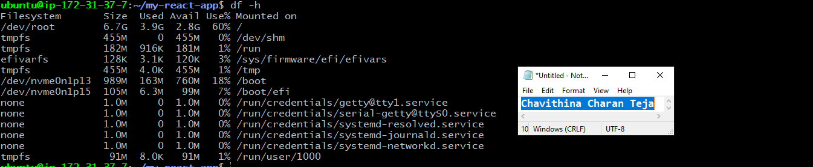

---

#### Screenshot 4 — Output of `sudo du -sh /var/* | sort -h`

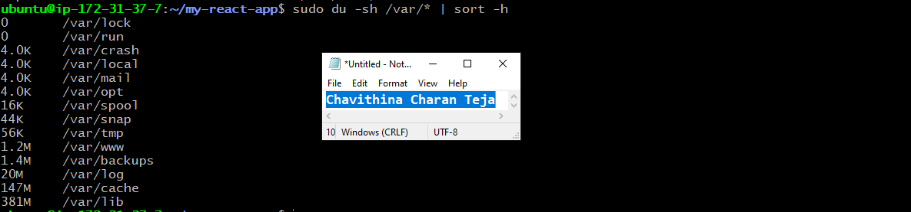

---

### Notes

Answer the following in your own words:

**1. Which resource looks most critical right now? (CPU/load, memory, or disk) Explain why.**

None of the three system resources currently show any signs of concern. CPU utilization is low, indicating the server is mostly idle, memory usage has sufficient available capacity with no swap activity, and disk utilization is at a healthy 61%, leaving adequate free space for normal operations.

If one resource were to be prioritized for ongoing monitoring as the server scales, disk usage would be the most important. Unlike CPU or memory utilization, which typically exhibit noticeable performance degradation when under pressure, disk usage often increases gradually due to factors such as growing log files, application data, or package cache accumulation. Without regular monitoring, disk space can become exhausted unexpectedly, potentially causing application failures or preventing critical system services from functioning properly. Proactive monitoring and periodic cleanup help prevent disk-related outages and ensure long-term system stability.

---

**2. What happens if disk becomes 100% full in a production server?**

When a server runs out of disk space, several critical issues can occur. Log files may no longer be able to record new entries, which is particularly problematic because logs are often essential for diagnosing incidents and troubleshooting failures. Applications, package managers, and build tools that require temporary disk space may fail to execute correctly or crash unexpectedly.

If a database is running on the server, it may be unable to write new data, potentially leading to service interruptions or, in severe cases, data corruption. When disk space is completely exhausted, the operating system itself can become unstable. Essential services may fail, and even routine administrative tasks, such as logging in via SSH or starting system services, may no longer work because the system lacks the free space required for normal operation. Regular monitoring of disk usage and timely cleanup are therefore essential to maintain system reliability and availability.

---

# Task 5 — Configuration & Deployment Verification

## Goal

Ensure the correct React build is deployed and Nginx is serving it properly.

### Evidence

#### Screenshot 1 — Output of `ls -lah /var/www/html | head -n 20`

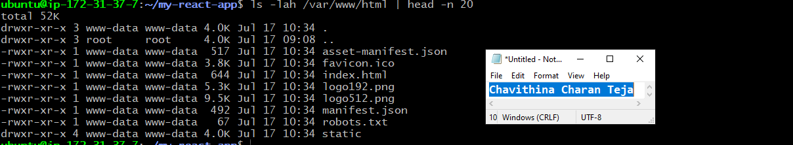

---

#### Screenshot 2 — Output of `grep -R "Deployed by" -n /var/www/html 2>/dev/null | head`

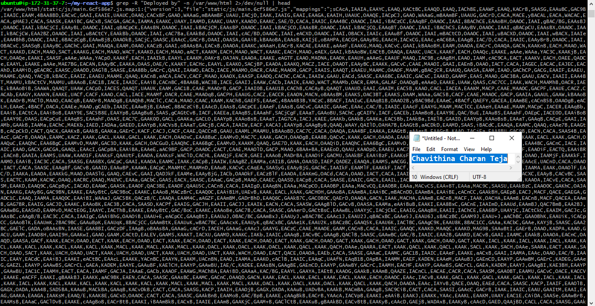

---

#### Screenshot 3 — Output of `grep -n "try_files" /etc/nginx/sites-available/default`

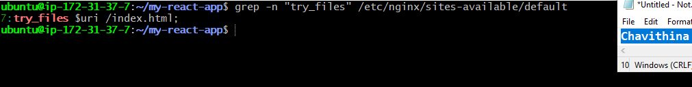

---

### Notes

Answer the following in your own words:

**1. How do you confirm that the correct version of the application is deployed?**

The deployment was verified using multiple validation steps rather than relying on a single command:

Running ls -lah /var/www/html confirmed that a valid Create React App (CRA) production build had been deployed. The directory contained index.html, the static/ folder with compiled JavaScript and CSS assets, and the standard CRA metadata files. All files were owned by www-data, the user under which Nginx worker processes run, ensuring the web server has the correct permissions to serve the application.
Executing grep -R "Deployed by" verified that the custom identifying text was present in the compiled JavaScript bundle and matched the original source through the associated source map. This confirmed that the intended application build—not an outdated or cached version—was deployed on the server.
Using grep -n "try_files" confirmed that the Nginx configuration includes the try_files $uri /index.html; directive. This ensures that requests for routes not corresponding to physical files are redirected to index.html, allowing the React Single Page Application (SPA) to handle client-side routing correctly.
Finally, these checks were validated against the earlier curl test from Task 3, which confirmed that the server was successfully serving the same index.html file over HTTP. This established a complete verification chain, linking the deployed files on disk to the content actually delivered to end users, and confirming that the deployment was successful and correctly configured.

---

# Task 6 — Nginx Configuration Failure Simulation

## Goal

Simulate a real-world Nginx misconfiguration and recover the service safely.

### Evidence

#### Screenshot 1 — Output of `sudo nginx -t` showing the syntax error (broken config)

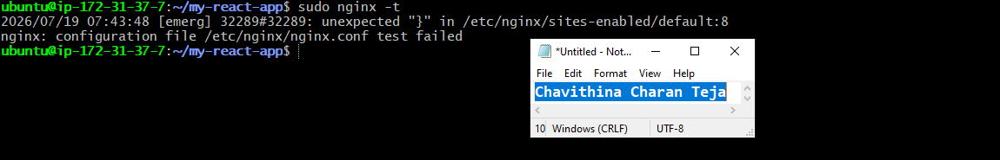

---

#### Screenshot 2 — Output of `sudo nginx -t` showing syntax ok (fixed config)

---

#### Screenshot 3 — Output of `curl -I http://<public-ip>` confirming recovery (200 OK)

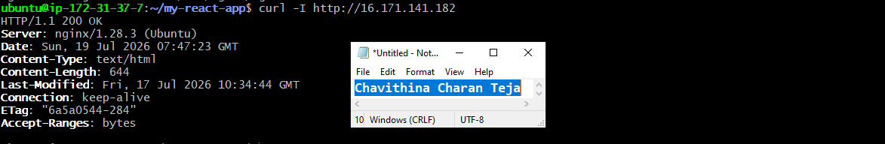

---

### Notes

Answer the following in your own words:

**1. What caused the configuration failure?**

The configuration file /etc/nginx/sites-available/default contained two missing semicolons. One was intentionally removed from the try_files $uri /index.html; directive as part of the exercise, while the second was also missing from the error_page 404 /index.html; directive. In Nginx configuration files, each directive must end with a semicolon. The absence of either semicolon prevents the Nginx parser from correctly interpreting the server block, resulting in a syntax error that causes the configuration validation (nginx -t) to fail and prevents the Nginx service from starting or reloading successfully.

---

**2. How did you fix the issue?**

To resolve the issue, the Nginx configuration file was reopened and the two missing semicolons were restored. After making the corrections, sudo nginx -t was executed to validate the configuration syntax. The service was restarted only after the output confirmed "syntax is ok" and "test is successful", ensuring the configuration was valid. Finally, an external curl -I request was used to verify that Nginx had restarted successfully and that the application was once again serving HTTP responses correctly, confirming the website was fully operational.

---

**3. How can you avoid this kind of issue in real production systems?**

Several best practices help prevent configuration-related outages in Nginx:

Always run nginx -t after making any configuration change to validate the syntax before restarting or reloading the service. This simple step catches most configuration errors before they impact production.
Store Nginx configuration files in version control (Git) so that any incorrect changes can be quickly reverted to a known-good version without relying on manual edits or memory.
Test configuration changes in a staging environment before deploying them to production. This helps identify issues in a safe environment without affecting end users.
Automate configuration validation as part of the CI/CD deployment pipeline. Running nginx -t and other validation checks during continuous integration ensures that invalid configurations are detected early and prevented from reaching the live server, significantly reducing the risk of production downtime.

---

# Task 7 — Web Application Failure Simulation

## Goal

Simulate missing deployment content and recover the application safely.

### Evidence

#### Screenshot 1 — Output of `curl -I http://<public-ip>` showing failure (non-200 response)

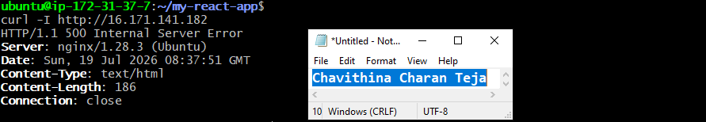

---

#### Screenshot 2 — Output of `curl -I http://<public-ip>` confirming recovery (200 OK)

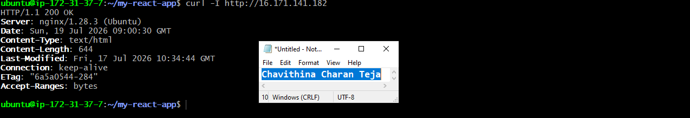

---

### Notes

Answer the following in your own words:

**1. What caused the application to break in this scenario?**

The web root directory (/var/www/html), which is the location from which Nginx serves website content, was intentionally emptied, removing all deployed application files. Although the Nginx service remained running and its configuration was still valid, the required application files—including index.html and the static assets—were no longer available. As a result, Nginx was unable to serve the React application. Because the configured fallback file (index.html) was also missing, requests resulted in a 500 Internal Server Error, indicating that the server was operational but unable to process the request due to the missing application content.

---

**2. How did you fix the issue and restore the application?**

The original deployment had been safely backed up before the test by moving the web root contents to html_backup rather than deleting them. Recovery was performed by removing the empty web root directory and restoring the backup to its original location at /var/www/html. After the files were restored, the Nginx service was restarted to ensure it was serving content from the recovered deployment.

The restoration was then verified using an external curl -I request, which returned a 200 OK response. The response headers, including Content-Length, Last-Modified, and ETag, matched those from the pre-incident state, confirming that the exact same application build had been successfully restored and that the website was once again fully operational.

---

**3. What steps would you take to prevent this kind of issue in real production systems?**

Several deployment best practices can help prevent this type of failure and improve recovery:

Automate pre-deployment backups so that every release has a restorable copy of the previous version, enabling immediate rollback without manual intervention if a deployment fails.
Deploy each release to a versioned directory and use an atomic symlink (for example, /var/www/current) to switch the live application to the new version. This approach ensures the active deployment is never left empty or partially updated, allowing seamless rollbacks by simply repointing the symlink.
Include deployment validation in the CI/CD pipeline by verifying that essential files, such as index.html, exist, are non-empty, and have been deployed successfully before the release is marked as complete.
Implement automated post-deployment health checks and monitoring to confirm that the application is immediately returning a successful HTTP 200 OK response after every deployment. This enables deployment issues to be detected within seconds, allowing rapid rollback or remediation instead of relying on manual discovery by users or administrators.

---

# Task 8 — Security & Reliability Review

## Goal

Review and reflect on the security and reliability practices applied during this assignment.

### Security & Reliability Notes

Answer the following in your own words:

**1. Why is SSH key-based authentication more secure than sharing passwords?**

SSH key-based authentication is more secure than sharing passwords because it uses public-key cryptography instead of a shared secret that can be guessed or stolen.

Some key security advantages include:

No password is transmitted over the network. During authentication, the server verifies ownership of the private key using cryptographic methods, so the actual private key or password is never sent.
Keys are far stronger than passwords. SSH keys are typically 2048-bit or 4096-bit, making them practically impossible to brute-force compared to human-created passwords.
The private key remains on the client. Only the public key is stored on the server, so even if the server is compromised, an attacker cannot use the public key to log in.
Reduced risk of password-related attacks. Key-based authentication protects against weak passwords, password reuse, and many brute-force or dictionary attacks that commonly target SSH services.
Supports additional security measures. Private keys can be encrypted with a passphrase, and SSH servers can be configured to disable password authentication entirely, significantly reducing the attack surface.
Better for automation. Scripts, CI/CD pipelines, and deployment tools can authenticate securely using SSH keys without exposing or sharing passwords.

Overall, SSH key-based authentication provides stronger security, better protection against common attacks, and a safer method for managing remote access than sharing passwords.

---

**2. Why should only required ports be open on a production server?**

On a production server, only the ports required for the application should be open because each open port represents a potential entry point for attackers. Unnecessary services increase the attack surface, making the server more vulnerable to port scans, brute-force attacks, exploitation of software vulnerabilities, and unauthorized access.

Following the principle of least exposure, only essential services—such as port 80/443 for web traffic and port 22 for SSH (preferably restricted to trusted IP addresses)—should be accessible. All other ports should remain closed or blocked by the firewall and cloud security groups.

From a DevOps perspective, minimizing exposed ports improves the overall security posture, simplifies firewall and network policies, reduces compliance risks, and makes monitoring more effective by limiting the number of services that need to be managed. It also reduces the likelihood of accidental exposure of development tools, databases, or internal services that are not intended to be publicly accessible.

As part of production operations, teams should regularly audit listening ports using commands such as ss -tulpen or netstat, review firewall rules, and remove any unnecessary services. This proactive approach helps maintain a secure, reliable, and well-managed production environment while reducing the risk of security incidents.

---

**3. Why is it important for Nginx to be enabled on boot?**

It is important for Nginx to be enabled on boot so that the web server starts automatically whenever the system reboots, whether due to planned maintenance, security updates, or an unexpected power failure. This ensures the application becomes available again without requiring manual intervention.

From a DevOps perspective, automatic startup improves service reliability, availability, and operational resilience. If Nginx is not enabled, the server may boot successfully, but the website will remain inaccessible until someone manually starts the service, resulting in unnecessary downtime and a poor user experience.

Enabling Nginx on boot also supports high availability and disaster recovery practices by ensuring services recover automatically after a restart. Combined with monitoring, health checks, and automated deployment pipelines, it helps maintain continuous service availability and reduces operational overhead.

In production environments, configuring essential services such as Nginx to start automatically is considered a best practice, as it helps ensure that applications remain available and recover quickly from planned or unplanned system restarts.

---

**4. What are the risks of sharing secrets, keys, or credentials publicly?**

Sharing secrets, API keys, SSH keys, passwords, tokens, or cloud credentials publicly can allow attackers to gain unauthorized access to servers, applications, databases, or cloud resources. Once exposed, these credentials can be used to steal sensitive data, deploy malicious code, modify infrastructure, or disrupt services.

In cloud environments, leaked credentials may enable attackers to create or delete resources, resulting in data loss, service outages, or significant financial costs. Exposed SSH private keys or administrator credentials can give attackers direct access to production servers, while leaked API tokens may allow unauthorized access to third-party services or internal applications.

Publicly exposed secrets can also lead to compliance violations, reputational damage, and legal consequences if customer or business data is compromised. Since attackers continuously scan public repositories and websites for exposed credentials, even accidental exposure can be exploited within minutes.

From a DevOps perspective, secrets should never be hardcoded in source code or committed to Git repositories. Instead, they should be stored in secure secrets management solutions such as AWS Secrets Manager, HashiCorp Vault, Azure Key Vault, or Kubernetes Secrets (with appropriate encryption). Access should follow the principle of least privilege, credentials should be rotated regularly, and any exposed secret should be revoked and replaced immediately.

Protecting secrets is a fundamental DevSecOps practice that helps maintain the confidentiality, integrity, and availability of production systems while reducing the risk of security incidents and unauthorized access.

---

**5. Why should cloud resources be stopped or terminated when they are no longer needed?**

Cloud resources should be stopped or terminated when they are no longer required because cloud providers charge for compute, storage, networking, and other services based on usage. Leaving unused resources running results in unnecessary costs and inefficient use of the cloud environment.

From a DevOps perspective, removing unused resources also reduces the attack surface by eliminating idle virtual machines, databases, or services that could become targets for attackers if left unpatched or misconfigured. It simplifies infrastructure management, makes monitoring more effective, and reduces operational overhead.

Regularly cleaning up unused resources helps prevent configuration drift, avoids orphaned infrastructure, and keeps environments organized. It also ensures that only active workloads consume resources, making capacity planning and cost tracking more accurate.

As a best practice, DevOps teams use Infrastructure as Code (IaC) tools such as Terraform or CloudFormation together with automation to create, update, and destroy infrastructure as needed. They also implement resource tagging, lifecycle policies, and scheduled shutdowns for non-production environments to optimize cloud spending while maintaining a secure and well-managed infrastructure.

By terminating or stopping unused cloud resources, organizations improve cost efficiency, security, operational reliability, and governance, while ensuring that the cloud environment remains clean, scalable, and easy to manage.

---

# LinkedIn Post (Required)

## Evidence

#### LinkedIn Post URL

Paste your LinkedIn post URL here:

[https://www.linkedin.com/posts/charanteja-chavithina-7503aa25a_dmibypravinmishra-devops-agenticai-activity-7484537933627023360-UwCg?utm_source=share&utm_medium=member_desktop&rcm=ACoAAD_GNawBqypXzEm7uRwAtjIXUFi95VCH6dg]

---

#### Screenshot — Published LinkedIn post

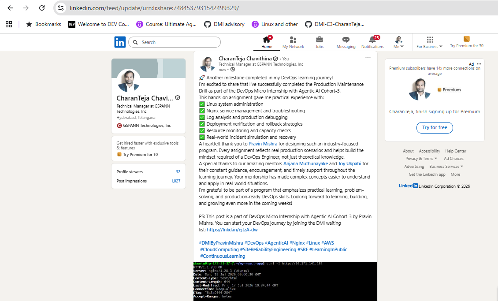

---

# Submission Instructions

- Add all required screenshots in your submission
- Full name must be visible in required screenshots
- Do not expose sensitive information (keys, passwords, account IDs)

---

# Completion Checklist

- [X] Task 1: Screenshots (browser, ip a, ss -tulpen, ufw status) + Notes answered
- [X] Task 2: Screenshots (nginx status, nginx -t, ss port 80) + Notes answered
- [X] Task 3: Screenshots (access log, error log, journalctl) + Notes answered
- [X] Task 4: Screenshots (uptime, free -h, df -h, du -sh) + Notes answered
- [X] Task 5: Screenshots (ls html, grep deployed by, grep try_files) + Notes answered
- [X] Task 6: Screenshots (nginx -t fail, nginx -t pass, curl recovery) + Notes answered
- [X] Task 7: Screenshots (curl failure, curl recovery) + Notes answered
- [X] Task 8: Security & Reliability Notes answered
- [X] LinkedIn post published and URL submitted
- [X] Full Name visible in all required screenshots
- [X] No sensitive data exposed

---

## 📌 About DMI & CloudAdvisory

DevOps Micro Internship (DMI) is a project-based DevOps program run by Pravin Mishra (The CloudAdvisory) focused on real-world execution, systems thinking, and career readiness.

It helps learners build strong DevOps foundations with hands-on experience.

---

## 📌 Resources

- 🌐 DMI Official Website: https://pravinmishra.com/dmi  
- 🎓 DevOps for Beginners (Udemy): https://www.udemy.com/course/devops-for-beginners-docker-k8s-cloud-cicd-4-projects/  
- 🎓 Agentic AI DevOps with Claude Code: https://www.udemy.com/course/ultimate-agentic-ai-devops-with-claude-code/  
- 🎓 DevOps with Claude Code: Terraform, EKS, ArgoCD & Helm: https://www.udemy.com/course/devops-with-claude-code-terraform-eks-argocd-helm/  
- ▶️ YouTube Playlist: https://www.youtube.com/playlist?list=PLFeSNDtI4Cho  
- 🔗 Pravin Mishra (LinkedIn): https://www.linkedin.com/in/pravin-mishra-aws-trainer/  
- 🏢 CloudAdvisory (LinkedIn): https://www.linkedin.com/company/thecloudadvisory/

---

*This submission is part of DevOps Micro Internship (DMI) Cohort 3 — Agentic AI Track.*