# Assignment 5 — Bash Script Automation Drill (OPS Checklist)

Part of the DevOps Micro Internship (DMI) Cohort 3 with Agentic AI

---

## Purpose

In this assignment, you will practice Bash scripting by building a series of small automation scripts covering environment setup, variables, arrays, loops, file conditionals, if-else logic, and functions. These scripts form the foundation of real-world Linux automation used in DevOps, cloud, and production support environments.

---

# Task 1 — Bash Environment & Workspace Setup

## Goal

Verify that Bash is available on your system and create a clean workspace for this assignment.

### Evidence

#### Screenshot 1 — Output of `echo $SHELL` and `bash --version`

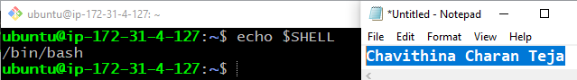
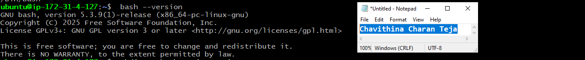

---

#### Screenshot 2 — Output of `pwd` and `ls -lah` showing the scripts directory

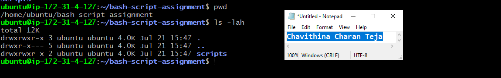

---

### Notes

Answer the following in your own words:

**1. What is Bash?**

Bash (Bourne Again Shell) is the default command-line shell used in most Linux operating systems. It acts as an interface between the user and the Linux kernel, allowing users to execute commands, manage files, automate repetitive tasks, and run shell scripts.

Bash can execute commands entered manually or commands stored in a script file. It is widely used by Linux system administrators, DevOps engineers, and developers to automate system administration, application deployment, monitoring, and other operational tasks.

---

**2. What is the difference between shell and Bash?**

A **shell** is a program that provides a command-line interface for users to interact with the operating system. It accepts user commands, passes them to the operating system for execution, and displays the results.

**Bash (Bourne Again Shell)** is one of the most popular and widely used Linux shells. Other common shells include:

* **sh (Bourne Shell)** – The original Unix shell.
* **Bash (Bourne Again Shell)** – An enhanced version of sh with scripting and advanced features.
* **zsh (Z Shell)** – Offers powerful customization, plugins, and auto-completion.
* **ksh (Korn Shell)** – Designed for efficient scripting and compatibility with sh.
* **fish (Friendly Interactive Shell)** – User-friendly shell with syntax highlighting and intelligent suggestions.

Although all shells perform the same basic function—allowing users to interact with the operating system—they differ in their syntax, features, configuration files, and scripting capabilities.

---

**3. Why is it important to confirm the Bash version before writing scripts?**

Confirming the Bash version verifies that Bash is installed and identifies the available version. This helps ensure that the syntax and features used in our scripts are supported by the system. 

---

# Task 2 — Your First Bash Script

## Goal

Create your first Bash script, make it executable, and run it from the terminal.

### Evidence

#### Screenshot 1 — Content of `first-script.sh`

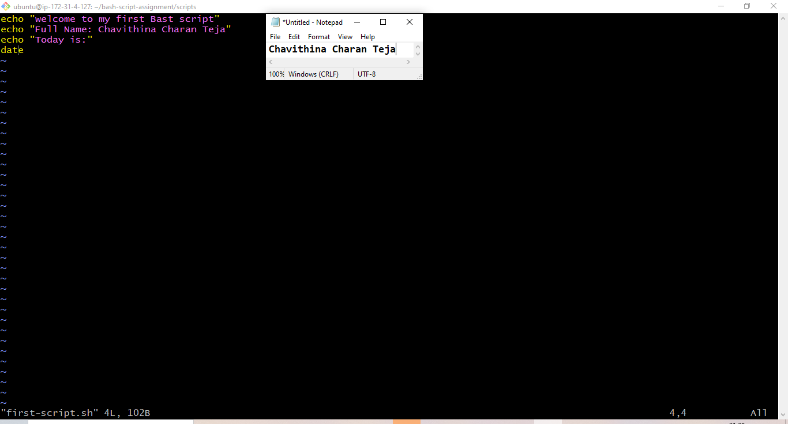

---

#### Screenshot 2 — Output of `./first-script.sh`

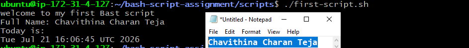

---

#### Screenshot 3 — Output of `ls -l first-script.sh` showing executable permission

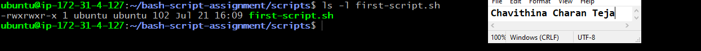

---

### Notes

Answer the following in your own words:

**1. What is the purpose of `#!/bin/bash`?**

#!/bin/bash is called the shebang line. It tells the operating system to use the Bash interpreter to run the commands inside the script. 

---

**2. Why do we use `chmod +x` before running a script?**

A newly created script may not have execute permission. The chmod +x command adds execute permission, allowing us to run the script directly using ./first-script.sh. 

---

**3. What is the difference between running a script using `./script.sh` and `bash script.sh`?**

When we run: ./script.sh the system runs the file directly. Therefore, the script must have execute permission, and the shebang line determines which interpreter should run it. 

When we run: bash script.sh we are directly asking Bash to read and run the script. The script does not need execute permission for this method, and Bash is used even if the script has a different shebang. 

---

# Task 3 — Variables: User Information Script

## Goal

Use variables to store and display user-related information.

### Evidence

#### Screenshot 1 — Content of `user-info.sh`

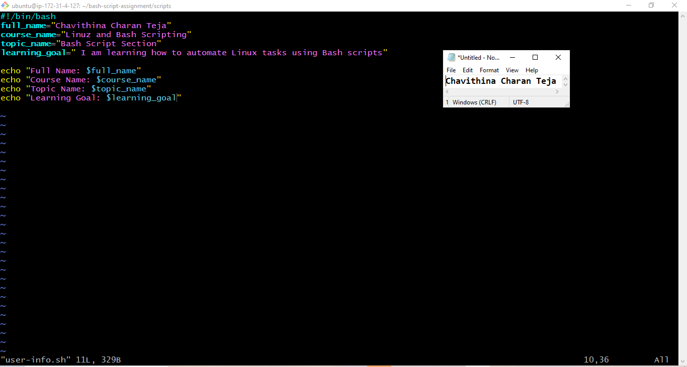

---

#### Screenshot 2 — Output of `./user-info.sh`

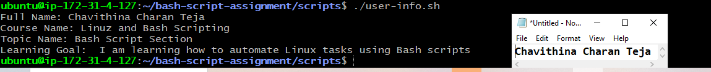

---

### Notes

Answer the following in your own words:

**1. What is a variable in Bash?**

A variable is a name used to store a value that we can use later in the script. For
example, we can store a person’s name inside a variable and display it whenever it is
needed.

---

**2. Why should we avoid spaces around the `=` sign when creating variables?**

Bash does not allow spaces around the = sign when assigning a value to a variable.
If we add spaces, Bash may treat the variable name and value as separate
commands instead of a variable assignment.
Correct:
course_name="Linux and Bash Scripting"
Incorrect:
course_name = "Linux and Bash Scripting"
- Bash tries to run it as a command
- Course_name -> command
- = } argument
- "Linux and Bash Scripting"} value

---

**3. How do you access the value stored inside a Bash variable?**

We add the $ symbol before the variable name to access its stored value.
Example: echo "$course_name"
Here, $course_name returns the value stored inside the course_name variable.
Linux and Bash Scripting

---

# Task 4 — Arrays & Loops: Tools Checklist Script

## Goal

Use arrays and loops to print a checklist of tools used in Bash scripting.

### Evidence

#### Screenshot 1 — Content of `tools-checklist.sh`

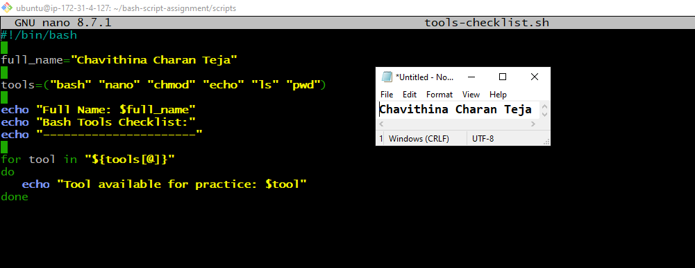

---

#### Screenshot 2 — Output of `./tools-checklist.sh`

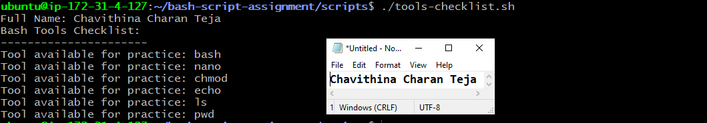

---

### Notes

Answer the following in your own words:

**1. What is an array in Bash?**

An array is used to store multiple values under one variable name. In this script, the
tools array stores several Linux and Bash tools.
Example:
tools=("bash" "nano" "chmod" "echo" "ls" "pwd")

---

**2. Why are arrays useful in scripts?**

Arrays allow us to keep related values together. Instead of creating a separate
variable for every tool, we can store all the tools in one array and process them using
a loop. This makes the script shorter and easier to update.

---

**3. What does `"${tools[@]}"` mean?**

"${tools[@]}" represents all the values stored inside the tools array. In this script, it
gives the loop access to every tool in the array.
The double quotes help keep each array item as a separate value. This is especially
important when an item contains spaces.

---

**4. What is the purpose of the `for` loop in this script?**

The for loop goes through each value in the tools array one by one. During each
round, the current value is stored in the tool variable and printed in the terminal.
For example, during the first round, $tool contains bash. During the next round, it
contains nano, and the loop continues until every tool has been printed.

---

# Task 5 — Loops: Number Counter Script

## Goal

Use loops to repeat a task multiple times.

### Evidence

#### Screenshot 1 — Content of `counter.sh`

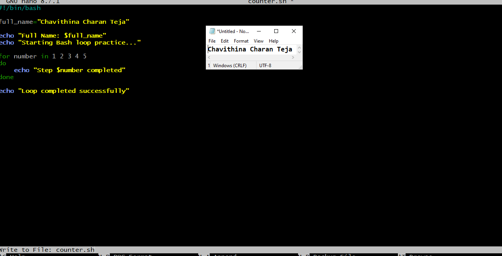

---

#### Screenshot 2 — Output of `./counter.sh`

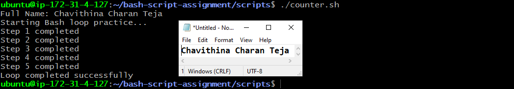

---

### Notes

Answer the following in your own words:

**1. What is a loop?**

A loop is used to repeat a task multiple times. Instead of writing the same command
again and again, we can write it once inside a loop.

---

**2. Why do we use loops in Bash scripting?**

We use loops to automate repetitive tasks. They make our scripts shorter and save
us from writing the same commands many times.

---

**3. How many times did the loop run in your script?**

The loop ran five times because we gave it five values:
1 2 3 4 5
It ran once for each number.

---

**4. What would you change if you wanted the loop to run 10 times?**

I would add the numbers 6 to 10 to the for loop:
for number in 1 2 3 4 5 6 7 8 9 10
do
 echo "Step $number completed"
done

---

# Task 6 — Files & Conditionals: File Validation Script

## Goal

Use file checks and conditionals to verify whether files and directories exist.

### Evidence

#### Screenshot 1 — Output of `ls -lah ../test-folder`

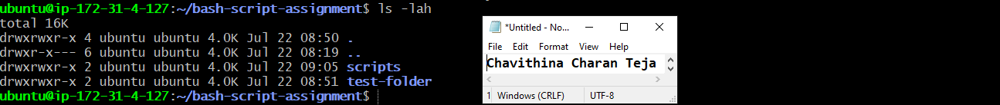

---

#### Screenshot 2 — Content of `file-check.sh`

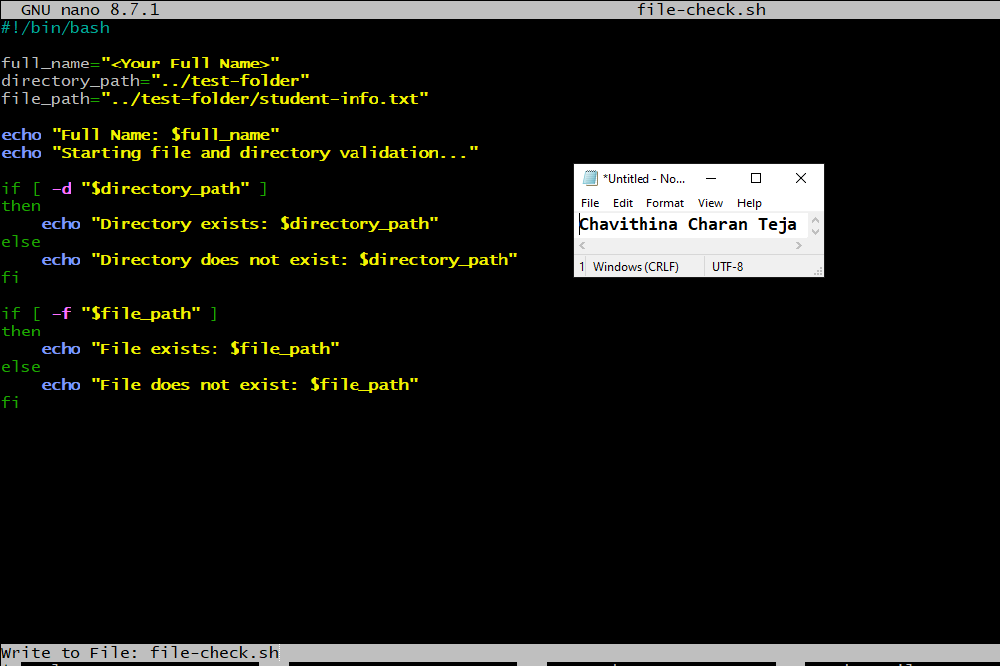

---

#### Screenshot 3 — Output of `./file-check.sh`

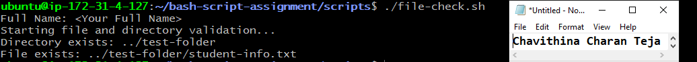

---

### Notes

Answer the following in your own words:

**1. What does `-d` check in Bash?**

The -d option checks whether the given path exists and whether it is a directory. If
the directory exists, the condition becomes true.

---

**2. What does `-f` check in Bash?**

The -f option checks whether the given path exists and whether it is a regular file. If
the file exists, the condition becomes true.

---

**3. Why should file and directory paths be stored in variables?**

Storing paths in variables makes the script easier to read and update. If a path
changes, we only need to update the variable instead of changing the same path in
several places.

---

**4. What happens if the file does not exist?**

If the file does not exist, the -f check becomes false. Therefore, the commands under
else will run, and the following message will be displayed:
File does not exist: ../test-folder/student-info.txt

---

# Task 7 — Conditionals: Pass or Retry Script

## Goal

Use if-else conditionals to make decisions based on a variable value.

### Evidence

#### Screenshot 1 — Content of `score-check.sh` with `score=85`

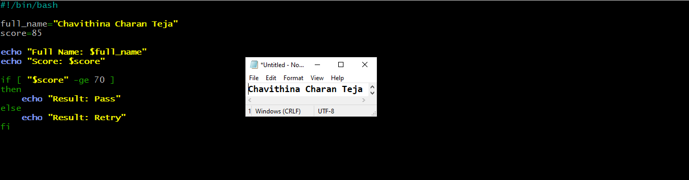
---

#### Screenshot 2 — Output showing `Result: Pass`

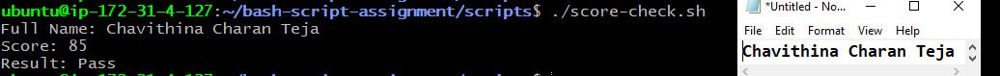

---

#### Screenshot 3 — Content of `score-check.sh` with `score=55`

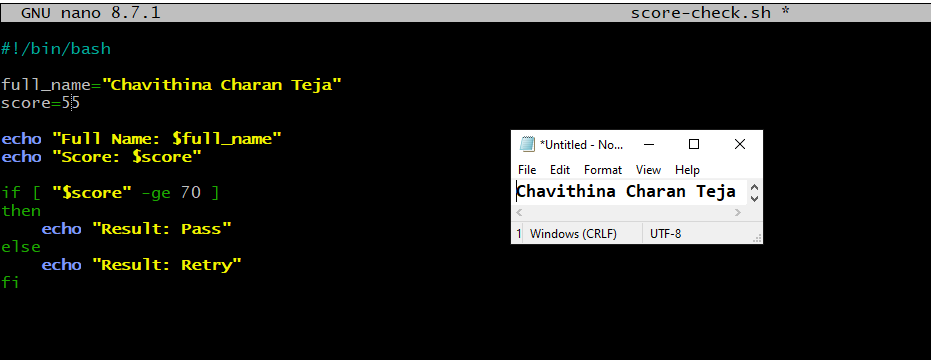

---

#### Screenshot 4 — Output showing `Result: Retry`

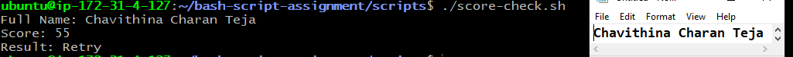

---

### Notes

Answer the following in your own words:

**1. What is the purpose of if-else in Bash?**

An if-else statement allows the script to make a decision. If the given condition is
true, it runs one set of commands. If the condition is false, it runs another set of
commands.

---

**2. What does `-ge` mean?**

-ge means greater than or equal to. In this script, it checks whether the score is
greater than or equal to 70.
[ "$score" -ge 70 ]

---

**3. Why should conditions be tested with different values?**

We should test conditions with different values to make sure every possible result
works correctly. Here, we use 85 to test the Pass result and 55 to test the Retry
result.
It is also helpful to test the exact boundary value, 70, because it should produce
Pass.

---

**4. How can conditionals help in automation scripts?**

Conditionals help automation scripts decide what to do based on the current
situation. For example, a script can check whether a service is running, a file exists,
or a disk is almost full, and then take the correct action based on the result.
Task 8 — Functions: Final Bash Automation Script
Navigate to the scripts directory
Run: cd ~/bash-script-a

---

# Task 8 — Functions: Final Bash Automation Script

## Goal

Create a final Bash script using functions to organize reusable code.

### Evidence

#### Screenshot 1 — Content of `final-automation.sh`

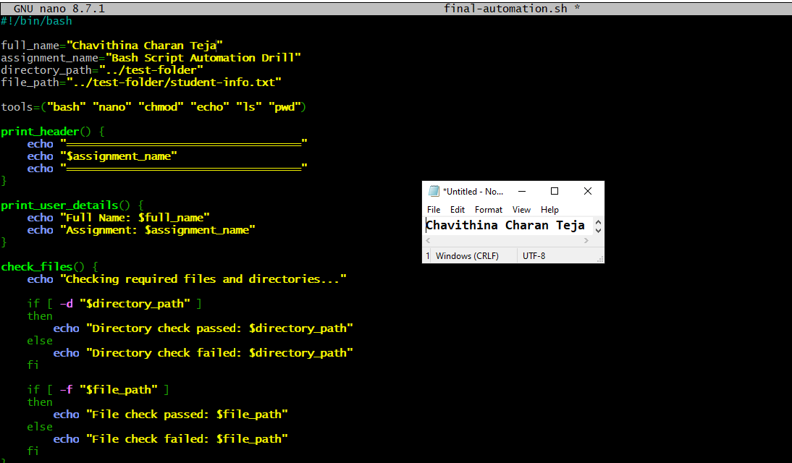

---

#### Screenshot 2 — Output of `./final-automation.sh`

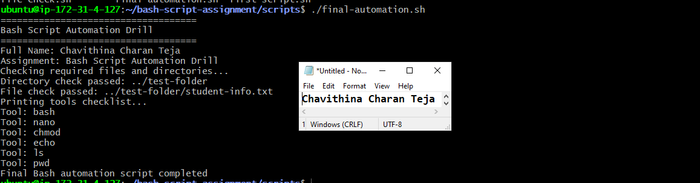

---

#### Screenshot 3 — Output of `ls -lah` showing all created scripts

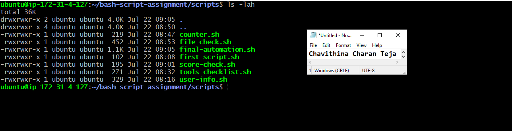

---

### Notes

Answer the following in your own words:

**1. What is a function in Bash?**

A function is a named block of commands created to perform a specific task. After
creating it, we can run all the commands inside it by calling the function name.

---

**2. Why are functions useful in scripts?**

Functions help us separate a large script into smaller sections. This makes the script
easier to read, manage, and troubleshoot. If we need the same task more than once,
we can call the function again instead of rewriting its commands.

---

**3. Which functions did you create in this script?**

I created four functions:
● print_header prints the assignment header.
● print_user_details prints my full name and the assignment name.
● check_files checks whether the required directory and file exist.
● print_tools uses a loop to print each tool stored in the array.

---

**4. How does this final script combine variables, arrays, loops, conditionals, files, and functions?**

The script uses variables to store my name, the assignment name, and the required
paths. It uses an array to store the tool names and a loop to print them one by one.
It uses if-else conditionals with -d and -f to check the required directory and file.
Finally, the related commands are organized into functions, and those functions are
called in the correct order to run the complete automation script

---

# LinkedIn Post (Required)

## Evidence

#### LinkedIn Post URL

Paste your LinkedIn post URL here:

<<<<<<< HEAD
`https://www.linkedin.com/posts/charanteja-chavithina-7503aa25a_dmibypravinmishra-devops-git-share-7485634882342395904-EsxN/?utm_source=share&utm_medium=member_desktop&rcm=ACoAAD_GNawBqypXzEm7uRwAtjIXUFi95VCH6dg`
=======
`Add your URL here`
>>>>>>> upstream/main

---

#### Screenshot — Published LinkedIn post

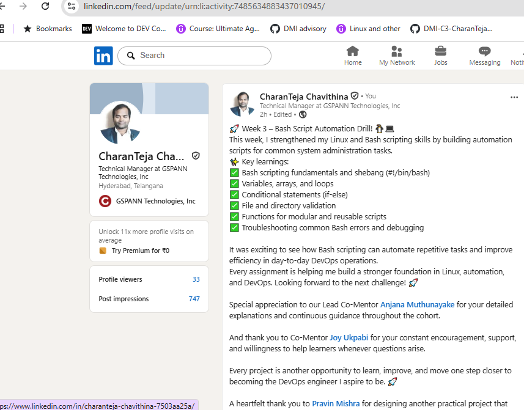

---

# Submission Instructions

- Add all required screenshots in your submission
- Full name must be visible in required screenshots
- All script files must be created and run successfully
- Required notes must be answered clearly for every task
- Do not expose sensitive information (keys, passwords, credentials)

---

# Completion Checklist

- [X] Task 1: Environment setup verified, workspace created (Screenshots 1–2, Notes answered)
- [X] Task 2: First script created, executed, permissions verified (Screenshots 1–3, Notes answered)
- [X] Task 3: Variables script created and run (Screenshots 1–2, Notes answered)
- [X] Task 4: Arrays and loops script created and run (Screenshots 1–2, Notes answered)
- [X] Task 5: Counter loop script created and run (Screenshots 1–2, Notes answered)
- [X] Task 6: File validation script created and run (Screenshots 1–3, Notes answered)
- [X] Task 7: Pass/Retry conditional script tested with both values (Screenshots 1–4, Notes answered)
- [X] Task 8: Final automation script created and run (Screenshots 1–3, Notes answered)
- [X] All scripts run without errors
- [X] Full Name visible in all required screenshots
- [X] LinkedIn post published and URL submitted
- [X] No sensitive data exposed

---

## 📌 About DMI & CloudAdvisory

DevOps Micro Internship (DMI) is a project-based DevOps program run by Pravin Mishra (The CloudAdvisory) focused on real-world execution, systems thinking, and career readiness.

It helps learners build strong DevOps foundations with hands-on experience.

---

## 📌 Resources

- 🌐 DMI Official Website: https://pravinmishra.com/dmi  
- 🎓 DevOps for Beginners (Udemy): https://www.udemy.com/course/devops-for-beginners-docker-k8s-cloud-cicd-4-projects/  
- 🎓 Agentic AI DevOps with Claude Code: https://www.udemy.com/course/ultimate-agentic-ai-devops-with-claude-code/  
- 🎓 DevOps with Claude Code: Terraform, EKS, ArgoCD & Helm: https://www.udemy.com/course/devops-with-claude-code-terraform-eks-argocd-helm/  
- ▶️ YouTube Playlist: https://www.youtube.com/playlist?list=PLFeSNDtI4Cho  
- 🔗 Pravin Mishra (LinkedIn): https://www.linkedin.com/in/pravin-mishra-aws-trainer/  
- 🏢 CloudAdvisory (LinkedIn): https://www.linkedin.com/company/thecloudadvisory/

---

*This submission is part of DevOps Micro Internship (DMI) Cohort 3 — Agentic AI Track.*