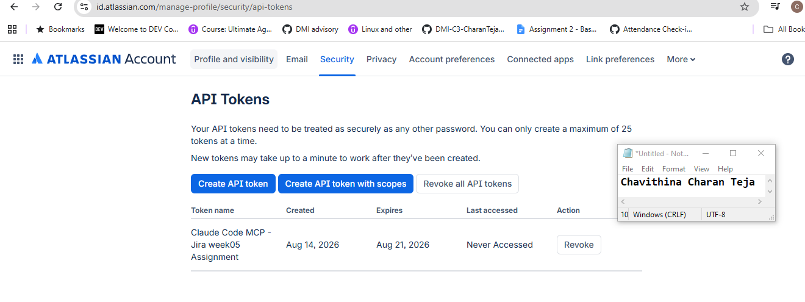
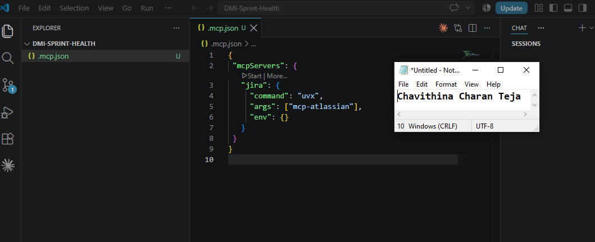
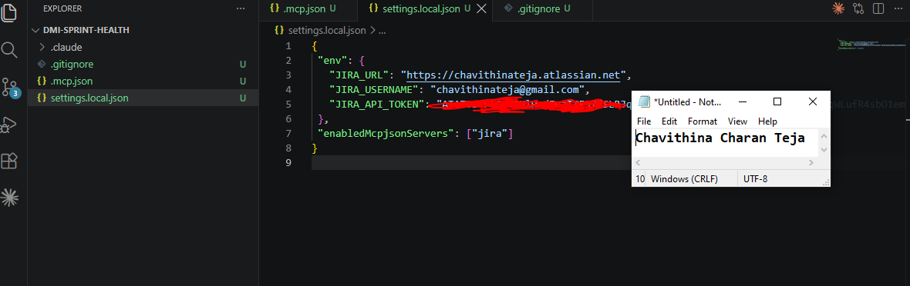
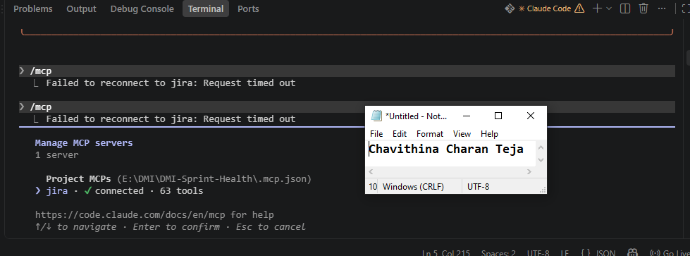
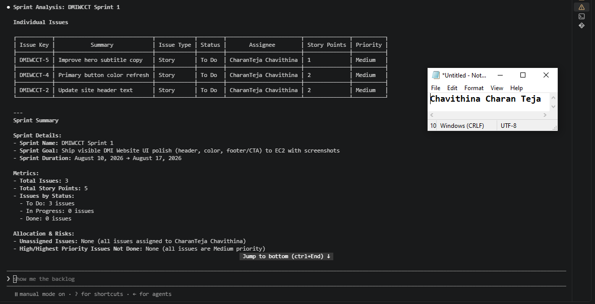
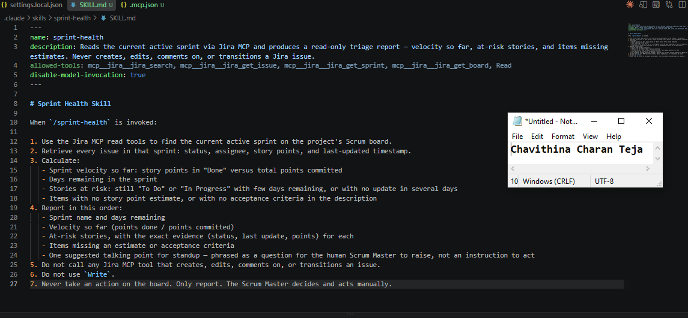
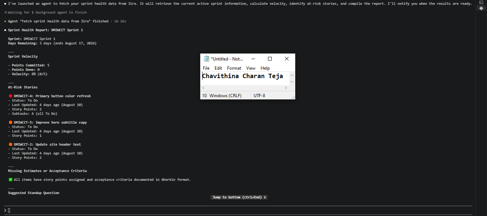
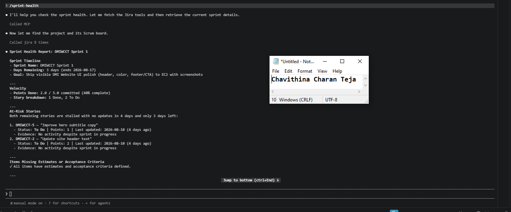

# Assignment 5 — AI-Assisted Sprint Health Report via Jira MCP

Part of the DevOps Micro Internship (DMI) Cohort 3 with Agentic AI

---

## Purpose

In this assignment, you will connect Claude Code to your Jira board through an MCP server, the same way you connected it to GitHub in Week 2, and build a read-only `/sprint-health` skill. The skill reads your current sprint through Jira's API and reports sprint velocity, stories at risk of missing the sprint, and items missing an estimate — but it must never create, edit, comment on, or transition a single ticket itself. You will prove that boundary holds by making a real change on the board yourself and confirming the skill only ever reports, never acts.

---

# Task 1 — Create a Jira API Token

## Goal

Generate an API token from your Atlassian account that the MCP server will use to authenticate with your Jira site. Do not screenshot the token value itself.

### Evidence

#### Screenshot 1 — Jira API token creation confirmation page showing the token name, with the token value not visible

### Notes You Must Write (Very Important):

Why does the MCP server need your site URL and account email in addition to the token?

Because the token is only one third of what a request needs, and it is the third that proves nothing on its own.

Atlassian Cloud authenticates REST calls with HTTP Basic auth, where the username is the account email and the password is the API token. The email is not metadata sitting alongside the credential, it is literally half of it. A token with no email attached cannot be presented as a credential at all.

The site URL is a separate problem. One Atlassian account can hold access to many sites, and the token does not encode which one is meant. https://gbadedata.atlassian.net is an address, not an identity.

I confirmed this rather than assuming it. Before touching MCP at all I ran a direct check that built a Basic header from email:token, base64-encoded it, and sent it to {JIRA_URL}/rest/api/3/myself. It returned my display name and email. Remove any one of the three values and the request either cannot be addressed or cannot be authorised.

---

# Task 2 — Create .mcp.json at the Project Root

## Goal

Create or update `.mcp.json` at your project root with a Jira MCP server block, following the same shape as the GitHub MCP server you configured in Week 2.

### Evidence

#### Screenshot 2 — `.mcp.json` open in VS Code showing the Jira server configuration

### Notes You Must Write (Very Important):

Compare this jira block to the github block from Week 2 Assignment 5. The GitHub server ran via npx (a Node.js package); this one runs via uvx (a Python package) — what stays exactly the same shape despite that difference, and why doesn't Claude Code care which language a given MCP server is written in?

The two blocks are structurally identical. Both are three keys: command, args, env.

"github": { "command": "npx", "args": ["-y", "@modelcontextprotocol/server-github"], "env": {} }
"jira":   { "command": "uvx", "args": ["mcp-atlassian"],                             "env": {} }

What changes is the string inside command and what goes in args. The shape does not move.

Claude Code does not care about the language because it never runs the server's code. It spawns a subprocess and speaks MCP to it over stdin and stdout. What happens inside that process is the process's own business. npx resolves and runs a Node package, uvx resolves and runs a Python package, and both end up as the same thing from Claude Code's point of view: a process on the other end of a pipe that speaks the protocol.

That is what a protocol is for. It specifies the wire format, not the implementation. The proof is visible in /mcp, where github · 26 tools and jira · 63 tools are listed identically despite one being Node and the other Python.

---

# Task 3 — Add Your Credentials to settings.local.json

## Goal

Add your Jira site URL, account email, and API token to `.claude/settings.local.json`, and confirm that file is listed in `.gitignore` so it is never committed.

### Evidence

#### Screenshot 3 — `settings.local.json` open in VS Code showing the `env` section, with the actual token value blurred or covered

### Notes You Must Write (Very Important):

Why must JIRA_API_TOKEN live in settings.local.json and never in .mcp.json?

Because the two files have different audiences, and only one of them is committed.

.mcp.json is tracked in git and pushed to a public GitHub repository. It describes how to start the server, which is shareable and useful. Anyone cloning the repo needs it to reproduce the setup.

.claude/settings.local.json is listed in .gitignore. I verified this with git check-ignore -v rather than trusting it, and confirmed separately with git ls-files that the file is untracked before committing anything.

The obvious reason is that a token in .mcp.json would be pushed straight to a public repo. The less obvious reason is that it would be wrong even in a private one. The split is not only secret versus not secret, it is shared versus personal. My token is my identity, not the project's configuration. A teammate cloning this repo should supply their own, and the file layout should make that the natural thing to do rather than something they have to remember.

There is also no undo. A secret committed once remains in the history after it is removed from the current version, and the only real remedy is to revoke the token.

---

# Task 4 — Verify the Connection with /mcp

## Goal

Restart Claude Code and confirm the Jira MCP server shows as connected.

### Evidence

#### Screenshot 4 — `/mcp` output showing `jira: connected`

---

# Task 5 — Run a Live Query to Prove Real Board Data

## Goal

Ask Claude to list the issues in your current active sprint through the Jira MCP connection, and confirm the result matches what you see on your live board in the browser.

### Evidence

#### Screenshot 5 — Claude's response showing the live sprint issue list retrieved via Jira MCP

### Notes You Must Write (Very Important):

How did you confirm this was real board data and not something Claude guessed?

Three ways, increasingly hard to fake.

First, I asked for facts that were not in the conversation and could not be inferred from it: the internal board id (34), the sprint start timestamp to the minute (2026-07-31 21:17 UTC), and the sub-task key ranges GOTTO-8 through GOTTO-19. A plausible guess can produce a story list. It cannot produce an internal board id or a timestamp accurate to the minute.

Second, I compared the output against the board in the browser side by side. Keys, statuses, point values and sub-task counts all matched.

Third, and this is the one that actually settles it: I changed something in the browser and ran the skill again. The second report detected the change without being told, named the resolution timestamp of 23:36 UTC, and recomputed completed points from 1 to 2. A model guessing from context cannot detect a change made outside that context.

---

# Task 6 — Build the /sprint-health Skill

## Goal

Create a `/sprint-health` skill restricted to read-only Jira tools plus `Read`, with no issue-mutating tools and no `Write`. Run it and confirm it produces a report covering sprint velocity, at-risk stories, and items missing an estimate.

### Evidence

#### Screenshot 6 — `SKILL.md` frontmatter showing `allowed-tools` limited to read-only Jira tools plus `Read`, with `disable-model-invocation: true`

#### Screenshot 7 — `/sprint-health` output showing the full triage report against your real sprint

### Notes You Must Write (Very Important):

1. Which Jira MCP tools does this skill's allowed-tools list include, and which mutating tools (create issue, update issue, transition issue, add comment) does it deliberately exclude?

The skill deliberately allows only read-oriented Jira MCP tools:

mcp__jira__jira_search — search Jira issues mcp__jira__jira_get_issue — retrieve issue details mcp__jira__jira_get_sprint — retrieve sprint information mcp__jira__jira_get_board — retrieve board information Read — read local files when needed

It deliberately excludes mutating tools, such as:

Create issue Update/edit issue Transition issue Add comment

This keeps the /sprint-health skill read-only. It can inspect and report Jira data but cannot change anything.

2. Why does a Scrum Master need this restriction more than almost any other role in this course?

A Scrum Master needs this restriction because their role is primarily to facilitate, monitor, and help the team improve, not to secretly modify the team's work.

A read-only skill prevents the AI from accidentally:

Changing an issue's status Changing story points Reassigning work Creating or deleting issues Adding comments that could influence the team's record

This preserves the integrity of the Scrum board and sprint data. The Scrum Master can use AI to identify risks and provide insights, while humans remain responsible for deciding and making changes.

---

# Task 7 — Prove the Skill Never Mutates the Board

## Goal

Manually update one ticket on your board in the browser (for example, move a story to "Done" or add a missing estimate), then run `/sprint-health` again and confirm the new report reflects your change — proving the skill only ever reads live state and never wrote to the board itself.

### Evidence

#### Screenshot 8 — Second `/sprint-health` run showing the report now reflects your manual board change

### Notes You Must Write (Very Important):

Map this assignment to Gather → Analyze → Human Act → Verify from Week 3 Assignment 6. Which step did you perform manually in the browser, and why must that step stay human?

Gather. The skill retrieved board metadata, the active sprint, its issues and their sub-tasks through four read-only tools. No interpretation, just collection.

Analyze. It computed elapsed time against completed points, evaluated four risk rules explicitly and reported each as triggered or not, and separated stories missing estimates from sub-tasks that conventionally have none. It also noticed something it was not asked to look for: SCRUM-5 and SCRUM-16 describe the same deliverable, so the sprint totals were misleading.

Human Act. I opened SCRUM-5 in the browser and set it to Done, along with its four sub-tasks. The skill could not have done this. It has no tool capable of it, by design.

Verify. The second run detected the change without being told, timestamped it at 23:36 UTC, moved completed points from 1 to 2, and revised its own analysis in light of the new state.

Why the act must stay human. The analysis was a judgement call dressed as an observation. The skill inferred that two stories were duplicates from the similarity of their summaries. It happened to be right. It could easily have been wrong, because two stories can carry near-identical names and genuinely different scope, and nothing in the data distinguishes those cases.

The asymmetry is the point. A wrong read produces a bad report, which a human discards in ten seconds. A wrong write produces a bad board state, which propagates into the burndown, into velocity, into next sprint's capacity planning, and nobody notices because the board is supposed to be the source of truth. Reading is cheap to get wrong. Writing is not.

---

# Submission Instructions

Complete all tasks in sequence.

Your submission must include:
- All 8 required screenshots
- All the required notes

---

# Completion Checklist

- [X] Task 1: Jira API token created, value never screenshotted (Screenshot 1)
- [X] Task 2: `.mcp.json` has the Jira server block (Screenshot 2)
- [X] Task 3: Credentials stored in `settings.local.json`, token blurred, file gitignored (Screenshot 3)
- [X] Task 4: `/mcp` shows the Jira server connected (Screenshot 4)
- [X] Task 5: Live query returned real sprint data, verified against the browser (Screenshot 5)
- [X] Task 6: `/sprint-health` skill created with correct read-only `allowed-tools`, and produced a full report (Screenshots 6–7)
- [X] Task 7: A manual board change was reflected in a second `/sprint-health` run (Screenshot 8)
- [X] Skill never created, edited, transitioned, or commented on any issue
- [X] Reflection answered (Notes)
- [X] No API token value exposed

---

## 📌 About DMI & CloudAdvisory

DevOps Micro Internship (DMI) is a project-based DevOps program run by Pravin Mishra (The CloudAdvisory) focused on real-world execution, systems thinking, and career readiness.

It helps learners build strong DevOps foundations with hands-on experience.

---

## 📌 Resources

- 🌐 DMI Official Website: https://dmi.pravinmishra.com?utm_source=github&utm_medium=readme  
- 🎓 University: https://university.pravinmishra.com?utm_source=github&utm_medium=readme  
- 💬 Discord Community: https://discord.pravinmishra.com?utm_source=github&utm_medium=readme  
- 📝 Blog: https://dmi.pravinmishra.com/blog?utm_source=github&utm_medium=readme  
- ▶️ YouTube Playlist: https://www.youtube.com/playlist?list=PLFeSNDtI4Cho  
- 🔗 Pravin Mishra (LinkedIn): https://www.linkedin.com/in/pravin-mishra-aws-trainer/  
- 🏢 CloudAdvisory (LinkedIn): https://www.linkedin.com/company/thecloudadvisory/

---

*This submission is part of DevOps Micro Internship (DMI) Cohort 3 — Agentic AI Track.*
